# Mini Battle Simulator — Tài liệu kiến trúc, PvP online, phân quyền và bảo mật

Tài liệu mô tả hệ thống theo code hiện tại (Next.js 16 + Socket.IO trong một tiến trình Node, Firebase Auth/Firestore/FCM, SQLite, Claude API/CLI). Sơ đồ viết bằng Mermaid, xem được trực tiếp trên GitHub/VS Code.

Mục lục:

1. [Tổng quan hệ thống](#1-tổng-quan-hệ-thống)
2. [Sơ đồ tất cả tính năng](#2-sơ-đồ-tất-cả-tính-năng)
3. [Giao tiếp cho tính năng người vs người (online)](#3-giao-tiếp-cho-tính-năng-người-vs-người-online)
4. [Cơ chế phân quyền](#4-cơ-chế-phân-quyền)
5. [Bảo mật](#5-bảo-mật)
6. [Tiền tệ, thẻ bài, hộp quà](#6-tiền-tệ-thẻ-bài-hộp-quà)
7. [Chế độ xếp hạng và chống cày thắng](#7-chế-độ-xếp-hạng-và-chống-cày-thắng)
8. [Phụ lục: bảng API](#8-phụ-lục-bảng-api)

Kế hoạch kiếm tiền, nạp tiền và pháp lý: [MONETIZATION.md](MONETIZATION.md).

---

## 1. Tổng quan hệ thống

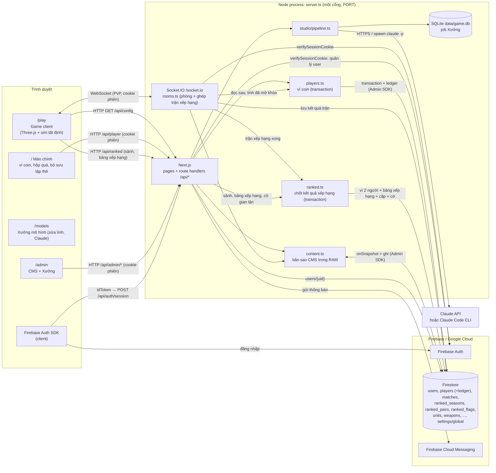

Điểm chính:

- **Một tiến trình Node** chạy cả Next.js và Socket.IO trên cùng cổng. Không có microservice, không có server-to-server giữa các node game. Muốn chạy nhiều instance cần thêm adapter (Redis) cho Socket.IO và sticky session — hiện **chưa có**.
- **Giao tiếp server-to-server** thực tế chỉ có: Node ↔ Firebase (Auth, Firestore, FCM qua Admin SDK) và Node ↔ Anthropic (Claude API) hoặc tiến trình con `claude` CLI.
- **Nội dung CMS** là nguồn chuẩn cho cả game, bot và kiểm tra đội hình online. Server giữ bản sao RAM qua snapshot listener; sửa trên CMS hay Firebase Console đều áp dụng từ trận sau.
- **Ví coin** (coin, thẻ, sao, lính đã mở khóa, giờ mở hộp, vé trận bot, hạng xếp hạng) nằm ở Firestore `players/{uid}`, chỉ server đọc/ghi, mỗi thay đổi là một transaction kèm dòng sổ giao dịch (mục 6).
- **Xếp hạng** dùng lại phòng online nhưng ghép tự động, không vào bằng mã; kết quả trận xếp hạng đổi ♦ của cả hai người trong một transaction (mục 7).

---

## 2. Sơ đồ tất cả tính năng

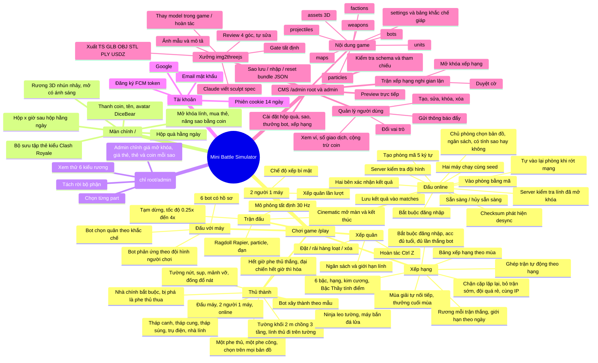

Bảng tính năng theo module code:

| Nhóm | Tính năng | Code chính |
| --- | --- | --- |
| Game | 4 chế độ `bot` / `local` / `online` / `ranked` | [GameClient.tsx](../src/components/game/GameClient.tsx) |
| Game | Mô phỏng tất định, checksum | [world.ts](../src/game/sim/world.ts), [engine.ts](../src/game/render/engine.ts) |
| Game | Kiểm tra đội hình (dùng chung client + server) | [army.ts](../src/game/sim/army.ts) |
| Game | Bot | [generate.ts](../src/game/bot/generate.ts) |
| Online | Xác thực socket, phòng, sẵn sàng, bắt đầu trận, desync | [rooms.ts](../src/server/rooms.ts), [net.ts](../src/shared/net.ts), [client.ts](../src/game/net/client.ts) |
| Online | Xác nhận và lưu kết quả trận | [matches.ts](../src/server/matches.ts) |
| Nội dung | Firestore + bản sao RAM + seed | [content.ts](../src/server/content.ts), [schema.ts](../src/shared/schema.ts) |
| Tài khoản | Phiên, hồ sơ, vai trò | [users.ts](../src/server/users.ts), [shared/users.ts](../src/shared/users.ts), [session route](../src/app/api/auth/session/route.ts) |
| CMS | CRUD collection, settings, bundle | [src/app/api/admin/](../src/app/api/admin/) |
| CMS | Quản lý user, FCM | [users routes](../src/app/api/admin/users/), [userAdmin.ts](../src/server/userAdmin.ts) |
| Xưởng | Pipeline Claude, gate, xuất file | [studio/](../src/server/studio/), [sculpt/](../src/game/sculpt/) |
| Kinh tế | Luật thuần: hộp quà, thưởng thắng bot (vé trận, giới hạn ngày), nâng sao, mở khóa, mua thẻ, cộng/trừ coin | [economy.ts](../src/shared/economy.ts) |
| Kinh tế | Ví Firestore trong transaction + sổ giao dịch, API người chơi / admin | [players.ts](../src/server/players.ts), [api/player](../src/app/api/player/route.ts), [wallet route](../src/app/api/admin/users/[uid]/wallet/route.ts) |
| Kinh tế | HUD coin, menu hộp quà, màn mở hộp, bộ sưu tập thẻ | [src/components/player/](../src/components/player/) |
| Kinh tế | Rương 3D procedural (6 kiểu) | [chest.ts](../src/game/models/chest.ts), [ChestStage.tsx](../src/components/player/ChestStage.tsx) |
| Xếp hạng | Luật thuần: bậc/hạng/♦, mùa, ghép trận, chống nhường trận | [ranked.ts](../src/shared/ranked.ts) |
| Xếp hạng | Hàng chờ, ghép cặp, phòng xếp hạng | [rooms.ts](../src/server/rooms.ts) |
| Xếp hạng | Chốt kết quả, bảng xếp hạng, cờ gian lận trên Firestore | [server/ranked.ts](../src/server/ranked.ts), [api/ranked](../src/app/api/ranked/route.ts), [api/admin/ranked](../src/app/api/admin/ranked/route.ts) |
| Xếp hạng | Sảnh, huy hiệu 6 bậc, bảng xếp hạng, kết quả ♦; trang admin | [ranked.tsx](../src/components/game/ranked.tsx), [RankedAdmin.tsx](../src/components/admin/RankedAdmin.tsx) |

---

## 3. Giao tiếp cho tính năng người vs người (online)

### 3.1 Mô hình: server làm trọng tài, không mô phỏng

Hai người chơi **không nói chuyện trực tiếp với nhau** (không P2P/WebRTC) và **không có server-to-server**. Luồng là **Client A ↔ Node server ↔ Client B** qua Socket.IO (chỉ transport `websocket`).

Server **không chạy trận**. Server làm 5 việc:

1. **Xác thực kết nối:** chỉ user đã đăng nhập, không bị khóa, mở từ đúng trang của site mới kết nối được (xem 3.7).
2. **Quản lý phòng:** tạo, vào, chỗ ngồi `blue`/`red`. Chỗ ngồi gắn với `uid`. Phòng xếp hạng do server tạo khi ghép cặp (mục 7).
3. **Kiểm tra đội hình** theo dữ liệu CMS: schema, lính tồn tại, trong vùng triển khai, số lính, ngân sách.
4. **Bắt đầu trận** khi cả hai sẵn sàng: sinh `seed` bằng `crypto.randomInt`, gửi `battle:start` gồm seed, hai đội hình và `configVersion`, đồng thời giữ bản ghi trận (`BattleRecord`) trên server.
5. **Trọng tài kết quả:** so checksum mỗi 30 tick (1 giây mô phỏng). Kết quả chỉ được lưu vào Firestore `matches` khi **hai bên báo khớp nhau** (xem 3.6).

Hai trình duyệt tự chạy cùng một trận. Mô phỏng chỉ dùng `+ - * /`, `Math.sqrt` và PRNG có seed, nên kết quả trùng từng bit.

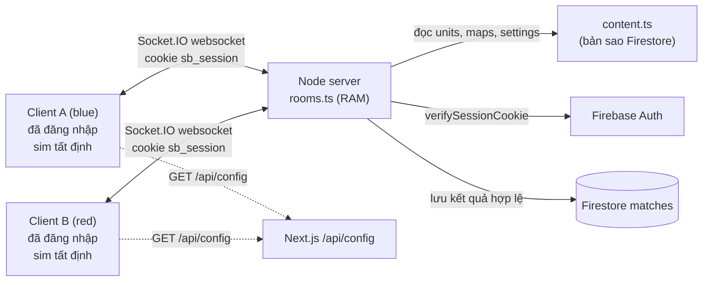

### 3.2 Giao thức sự kiện

Định nghĩa ở [src/shared/net.ts](../src/shared/net.ts). Client không gửi tên hay token: server lấy danh tính và tên hiển thị từ cookie phiên.

Client → Server:

| Sự kiện | Payload | Ack | Điều kiện server chấp nhận |
| --- | --- | --- | --- |
| `room:create` | — | `{ ok, code, side }` | CMS có ít nhất 1 map |
| `room:join` | `{ code }` | `{ ok, code, side }` | phòng tồn tại; `uid` đã có chỗ trong phòng thì lấy lại chỗ đó, không thì vào `red` nếu còn trống. Phòng xếp hạng: chỉ hai người đã được ghép, và chỉ tới khi trận của phòng kết thúc |
| `room:settings` | `{ mapId, budget, useStars, defense }` | — | chỉ `blue` (chủ phòng), phase `lobby`, không phải phòng xếp hạng, map tồn tại, budget 100–1.000.000, `useStars` boolean |
| `room:ready` | `{ army: Placement[] }` | `{ ok }` / `{ ok:false, error }` | phiên vẫn hợp lệ (kiểm tra lại với Firebase), phase `lobby`, `armySchema` (≤ 500), `validateArmy` pass, không rỗng, **mọi lính đã mở khóa** theo ví Firestore của người đó (server lưu luôn sao của các lính trong đội hình) |
| `room:unready` | — | — | phase `lobby` |
| `battle:checksum` | `{ tick, hash }` | — | đang có trận, bên này chưa báo kết thúc, `tick` là bội số dương của 30 và ≤ tick tối đa, mỗi tick chỉ nhận lần đầu |
| `battle:end` | `{ outcome: 'win' \| 'lose' \| 'draw', tick }` | — | đang có trận, bên này chưa báo; payload sai thì hủy kết quả |
| `battle:surrender` | — | — | đang có trận; bên này bị loại (xem 3.6) |
| `rank:queue` | — | `{ ok }` / `{ ok:false, error }` | phiên vẫn hợp lệ, không đang đánh, đủ điều kiện xếp hạng (mục 7.3); vào hàng chờ ghép trận |
| `rank:cancel` | — | — | rời hàng chờ |
| `room:leave` / `disconnect` | — | — | luôn (cũng rời hàng chờ) |

Server → Client:

| Sự kiện | Payload | Khi nào |
| --- | --- | --- |
| `room:state` | `{ code, phase, mapId, budget, useStars, defense, players: { name, ready, connected, units, cost }, deadline, ranked }` | mọi thay đổi phòng (gửi cả phòng); `ranked` = id mùa nếu là phòng xếp hạng |
| `battle:start` | `{ seed, mapId, budget, armies: { blue, red }, useStars, stars: { blue, red }, configVersion }` | cả hai `ready` và cùng đang kết nối; `stars` lấy từ ví lúc sẵn sàng, rỗng khi chủ phòng tắt sao |
| `battle:desync` | `{ tick }` | hash hai bên khác nhau tại cùng tick (lần đầu) |
| `battle:eliminate` | `{ side, tick }` | một bên đầu hàng / mất kết nối; mọi máy loại bên đó ở cùng một tick sắp tới |
| `battle:result` | `{ ok: true, winner }` / `{ ok: false, error }` | kết quả đã lưu, hoặc bị hủy kèm lý do |
| `rank:matched` | `{ code, side, opponent: { name, rank } }` | ghép trận xong, server đã xếp chỗ trong phòng xếp hạng |
| `rank:cancelled` | `{ reason }` | đối thủ rời phòng xếp hạng trước khi trận bắt đầu |
| `rank:result` | `{ ok: true, season, before, after, verdict, flags, reward? }` / `{ ok: false, error }` | ♦ trước/sau của chính mình, lý do không được ♦ (cờ), rương thắng |

Lưu ý: `room:state` **chỉ lộ tên, số lính và tổng chi phí**, không lộ vị trí/loại lính. Đội hình đối thủ chỉ gửi xuống lúc `battle:start`.

### 3.3 Trình tự một trận

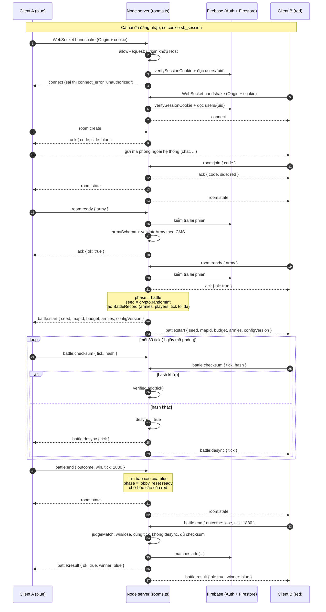

### 3.4 Vòng đời phòng và trận

`phase` quyết định có được xếp quân/sẵn sàng hay không; `battle` là bản ghi trận, tồn tại độc lập đến khi được lưu hoặc hủy. Người báo kết thúc trước có thể quay về xếp quân ngay, trong khi người kia vẫn xem nốt trận (ví dụ đang chạy 0.25×).

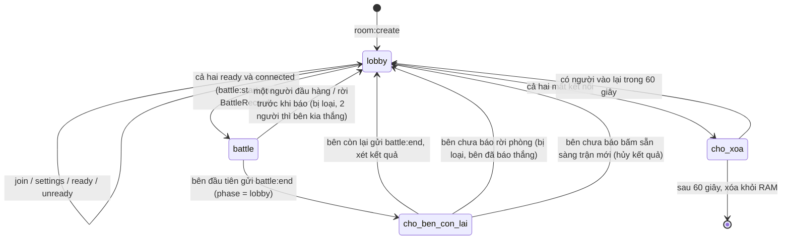

### 3.5 Rớt mạng và vào lại

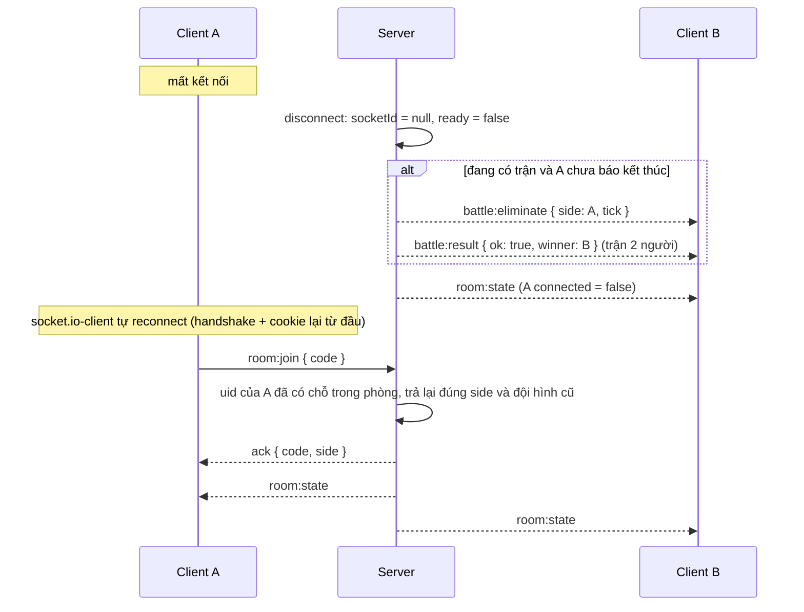

- Chỗ ngồi gắn `uid`, không còn token trong `sessionStorage`. Người khác không chiếm được chỗ, và một người không tự vào chỗ `red` trong phòng của mình.
- Trạng thái phòng chỉ nằm trong RAM: **khởi động lại server là mất mọi phòng và trận đang chờ xác nhận**.

### 3.6 Xác nhận kết quả trận

Mỗi client báo kết quả **theo góc nhìn của mình** (`win` / `lose` / `draw`) kèm tick kết thúc. Server chỉ xét khi **đủ báo cáo của cả hai bên** ([src/server/matches.ts](../src/server/matches.ts), `judgeMatch`):

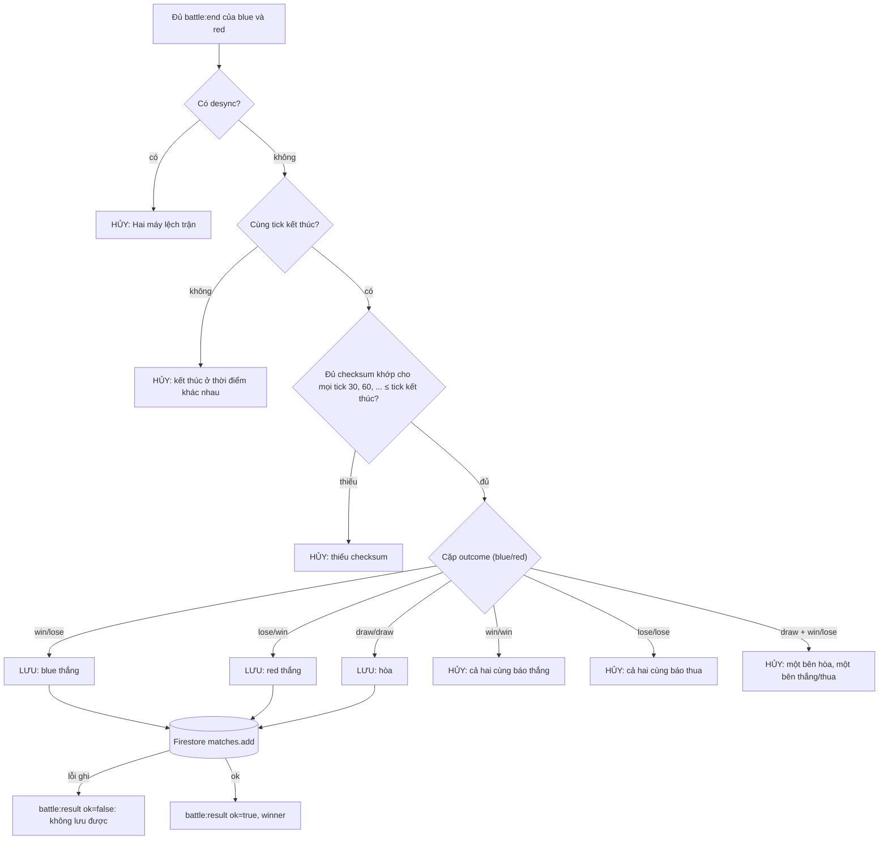

Các trường hợp hủy khác (không chờ đủ hai báo cáo):

| Tình huống | Kết quả |
| --- | --- |
| Người chưa báo kết thúc đầu hàng / rời phòng / mất kết nối | bị loại ở một tick sắp tới (`battle:eliminate`); trận 2 người thì bên còn lại **thắng ngay** và kết quả được lưu, 3–4 người thì những người còn lại đánh tiếp |
| Người chưa báo kết thúc bấm sẵn sàng cho trận mới | hủy (bỏ dở trận) |
| `battle:end` sai định dạng (outcome lạ, tick ngoài 1..tick tối đa) | hủy |
| Báo cáo thứ hai của cùng một bên | bỏ qua (chỉ nhận lần đầu) |

Tài liệu `matches/{autoId}` lưu:

| Trường | Ý nghĩa |
| --- | --- |
| `room`, `seed`, `mapId`, `budget`, `configVersion` | tham số trận do **server** giữ, không lấy từ client lúc kết thúc |
| `useStars`, `stars.blue/red` | có tính sao không và sao của từng loại lính mỗi bên (server đọc từ ví) |
| `players.blue/red` | `{ uid, name }` |
| `armies.blue/red` | đội hình đã được server kiểm tra, đủ để chạy lại trận |
| `ranked` | id mùa nếu là trận xếp hạng, `null` nếu phòng thường |
| `winner` | `blue` / `red` / `draw` |
| `endTick` | tick kết thúc hai bên cùng báo |
| `startedAt`, `endedAt` | thời điểm bắt đầu (server) và lưu (`serverTimestamp`) |

Firestore rules không mở `matches` cho client (mặc định cấm): chỉ server ghi bằng Admin SDK.

### 3.7 Lớp bảo vệ Socket.IO

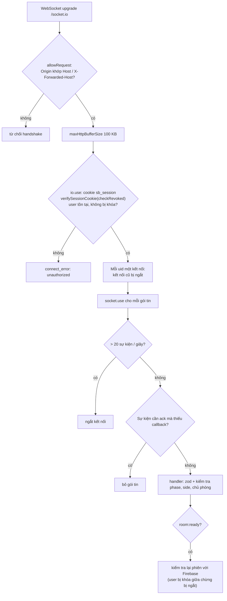

| Lớp | Chặn cái gì |
| --- | --- |
| Origin check | trang web lạ mở WebSocket tới server bằng trình duyệt của nạn nhân (Cross-Site WebSocket Hijacking) |
| Cookie phiên + `checkRevoked` + `disabled` | khách vô danh, cookie giả, tài khoản bị khóa hoặc đã bị thu hồi phiên |
| Kiểm tra lại phiên ở `room:ready` | tài khoản bị khóa trong lúc đang kết nối tiếp tục mở trận mới |
| Một kết nối mỗi `uid` | một tài khoản mở nhiều socket để tạo hàng loạt phòng, hoặc tự đấu với chính mình |
| Rate limit 20 sự kiện/giây, gói ≤ 100 KB | spam sự kiện, gói tin khổng lồ |
| Bỏ gói thiếu ack | **một gói `room:join` không có callback làm sập cả tiến trình Node** (lỗi đã xác nhận trước khi sửa: `TypeError: ack is not a function`) |
| zod + phase/side/chủ phòng | payload sai kiểu, gửi sự kiện sai thời điểm, người không phải chủ phòng đổi map |
| `validateArmy` trên server | đội hình vượt ngân sách, ngoài vùng, lính không tồn tại |
| Kiểm tra ví ở `room:ready` | dùng lính chưa mở khóa, tự khai sao (sao chỉ lấy từ Firestore, không nhận từ client) |
| Seed do server sinh, đội hình do server gửi | client tự chọn seed hoặc đổi đội hình sau khi đối thủ sẵn sàng |
| Checksum đối chiếu, tick hợp lệ, chỉ nhận lần đầu | client sửa đổi làm lệch trận, gửi checksum rác để làm phình bộ nhớ |
| Đồng thuận hai bên khi lưu kết quả | một client gian lận tự khai thắng |

**Giới hạn còn lại:** hai người **thông đồng** (hoặc một người cầm hai tài khoản) vẫn khai được kết quả tùy ý: tự gửi checksum giống nhau cho hai bên, một bên báo thắng một bên báo thua, hoặc đơn giản là cho tài khoản phụ đầu hàng. Phòng mã không có thưởng nên việc này chỉ làm bẩn thống kê `matches`. Ở xếp hạng, việc này không bị chặn tuyệt đối nhưng không còn lời (mục 7.5). Một người gian lận một mình khai thắng khi đang thua thì hai báo cáo lệch nhau: trận bị hủy và đếm là tranh chấp. Muốn chặn tuyệt đối thì server phải tự chạy lại trận từ `seed` + `armies` (mô phỏng tất định nên làm được, nên chạy trong `worker_threads`); đã cân nhắc và tạm không làm vì tốn CPU server. `matches` đã lưu đủ dữ liệu để làm sau, kể cả chỉ chạy lại các trận bị tranh chấp.

---

## 4. Cơ chế phân quyền

### 4.1 Vai trò

Lưu ở Firestore `users/{uid}.role` ([src/shared/users.ts](../src/shared/users.ts)):

| Giá trị | Vai trò | Quyền |
| --- | --- | --- |
| `0` | Root | toàn quyền CMS, quản lý mọi user khác (kể cả root/admin khác), cấp mọi vai trò |
| `1` | Admin | toàn quyền nội dung CMS + Xưởng; chỉ quản lý user role `2`; chỉ cấp role `2` |
| `2` | Người dùng | chơi mọi chế độ kể cả online (kết quả lưu theo `uid`), đăng ký FCM token, có ví coin (hộp quà, mở khóa, mua thẻ, nâng sao); không vào `/admin`, không vào `/models` (bị chuyển về trang đăng nhập CMS) |
| — | Khách (chưa đăng nhập) | chơi với máy, 2 người 1 máy **chỉ với lính miễn phí** (`unlockCost = 0`), đọc `/api/config`; **không** đấu online, không có ví, không vào `/models` |

Quy tắc (hàm thuần, dùng chung):

- `canAccessCms(user)`: đăng nhập, không bị khóa, `role <= 1`.
- `canManage(actor, target)`: không tự sửa chính mình; root quản lý tất cả; người khác chỉ quản lý người có `role` lớn hơn (thấp quyền hơn).
- `assignableRoles(actor)`: root cấp `0,1,2`; admin chỉ cấp `2`.
- Root đầu tiên: email trong `FIREBASE_ROOT_EMAILS` **và đã xác minh** (`emailVerified`) → mỗi lần đăng nhập được đặt `role = 0`.

### 4.2 Luồng xác thực

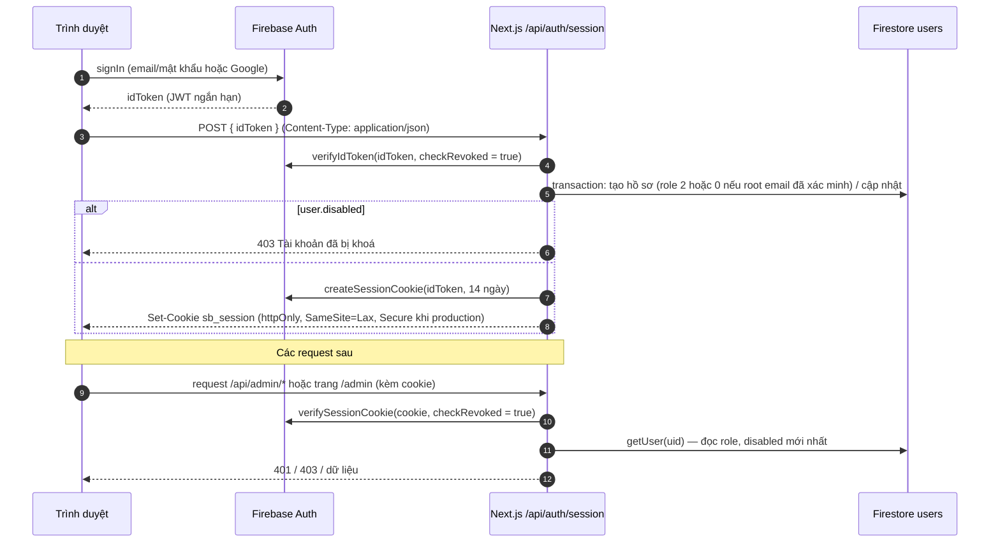

### 4.3 Kiểm tra quyền trên từng lớp

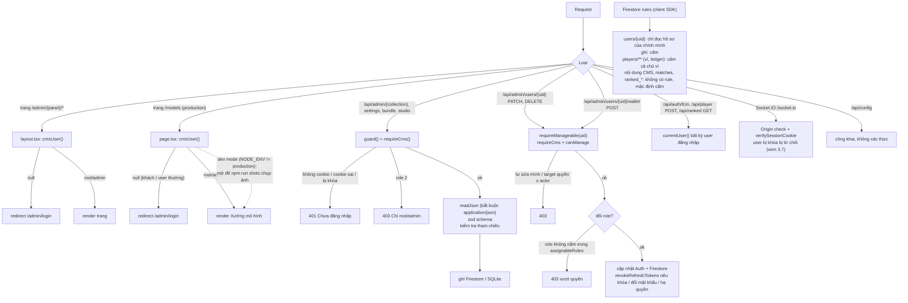

Ma trận quyền theo endpoint:

| Endpoint | Khách | User (2) | Admin (1) | Root (0) |
| --- | --- | --- | --- | --- |
| `GET /api/config` | ✓ | ✓ | ✓ | ✓ |
| Socket.IO `/socket.io` (PvP) | ✗ | ✓ | ✓ | ✓ |
| `GET/POST/DELETE /api/auth/session` | ✓ | ✓ | ✓ | ✓ |
| `POST /api/auth/fcm` | ✗ | ✓ | ✓ | ✓ |
| `GET /api/player` | ✓ (trả `player: null`) | ✓ ví của mình | ✓ | ✓ |
| `POST /api/player` (mở hộp, mở khóa, nâng sao, mua thẻ, vé/thưởng bot, thưởng mùa) | ✗ | ✓ ví của mình | ✓ | ✓ |
| `GET /api/ranked` (sảnh, bảng xếp hạng) | ✗ | ✓ | ✓ | ✓ |
| `GET /api/fonts/clash` | ✓ | ✓ | ✓ | ✓ |
| Trang `/admin/*` | ✗ | ✗ | ✓ | ✓ |
| Trang `/models` (production; dev mở để chụp ảnh) | ✗ | ✗ | ✓ | ✓ |
| `/api/admin/{collection}[/{id}]`, `settings`, `bundle` | ✗ | ✗ | ✓ | ✓ |
| `/api/admin/studio/**` (gọi Claude, tốn chi phí) | ✗ | ✗ | ✓ | ✓ |
| `GET /api/admin/users[/{uid}]` | ✗ | ✗ | ✓ (xem tất cả) | ✓ |
| `POST /api/admin/users` | ✗ | ✗ | chỉ tạo role 2 | mọi role |
| `PATCH/DELETE /api/admin/users/{uid}` | ✗ | ✗ | chỉ target role 2, không phải mình | mọi target trừ mình |
| `POST /api/admin/users/{uid}/notify` | ✗ | ✗ | ✓ (mọi user) | ✓ |
| `GET /api/admin/users/{uid}/wallet` | ✗ | ✗ | ✓ (mọi user) | ✓ |
| `POST /api/admin/users/{uid}/wallet` (cộng/trừ coin) | ✗ | ✗ | chỉ target role 2, không phải mình | mọi target trừ mình |
| `GET/POST /api/admin/ranked` (cờ gian lận, mở khóa xếp hạng) | ✗ | ✗ | ✓ (mọi user) | ✓ |

---

## 5. Bảo mật

### 5.1 Các biện pháp đang có

**Xác thực, phiên**

- Phiên dùng Firebase **session cookie** `sb_session`: `httpOnly` (JS không đọc được), `SameSite=Lax`, `Secure` ở production, tối đa 14 ngày.
- `verifyIdToken` và `verifySessionCookie` đều bật `checkRevoked`. Khóa user, đổi mật khẩu hoặc hạ quyền sẽ gọi `revokeRefreshTokens`, nên cookie cũ mất hiệu lực ngay.
- Mỗi request HTTP (và mỗi handshake Socket.IO) đọc lại hồ sơ Firestore, nên đổi `role`/`disabled` áp dụng tức thì, không phụ thuộc token cũ.
- Root bootstrap chỉ nhận **email đã xác minh**, tránh việc tạo tài khoản email/mật khẩu chưa xác minh trùng email root.

**Chống CSRF**

- Cookie `SameSite=Lax`: request cross-site bằng `fetch`/form POST không kèm cookie.
- `readJson` bắt buộc `Content-Type: application/json` cho mọi thao tác ghi, chặn form HTML cross-site (form không gửi được JSON content type mà không qua preflight CORS).
- WebSocket: kiểm tra `Origin` khi handshake (xem 3.7).

**Kiểm tra dữ liệu vào**

- Mọi payload API và Socket.IO đi qua **zod** (`COLLECTION_SCHEMAS`, `settingsSchema`, `armySchema`, `createUserSchema`, ...). Không đổi được `id` qua PUT.
- Kiểm tra tham chiếu chéo (`findRefIssues`) khi tạo/sửa/nhập, chặn xóa khi còn phụ thuộc (`findDependents`).
- Tài liệu Firestore sửa tay sai schema bị bỏ qua và ghi log, không làm hỏng game.
- Giới hạn kích thước: ảnh Xưởng ≤ 12 MB dạng data URL PNG/JPEG/WebP/GIF, sheet review ≤ 8 MB, prompt ≤ 4000 ký tự, idToken ≤ 4096, gói Socket.IO ≤ 100 KB.

**Firestore**

- Client SDK chỉ đọc được `users/{uid}` của chính mình; mọi ghi đi qua server (Admin SDK). Collection nội dung và `matches` không có rule nên client bị chặn mặc định; game đọc nội dung qua `/api/config`.
- Service account chỉ nằm ở biến môi trường server (`FIREBASE_SERVICE_ACCOUNT`), không có tiền tố `NEXT_PUBLIC_`.

**PvP online** — chi tiết ở [3.6](#36-xác-nhận-kết-quả-trận) và [3.7](#37-lớp-bảo-vệ-socketio)

- Bắt buộc đăng nhập, kiểm tra Origin, một kết nối mỗi tài khoản, rate limit, giới hạn kích thước gói, bỏ gói thiếu ack.
- Server là nguồn chuẩn cho **luật xếp quân** (`validateArmy` với dữ liệu CMS trên server), **seed** (`crypto.randomInt`) và **tham số trận** lưu vào `matches`.
- Kết quả chỉ lưu khi hai bên báo khớp (win/lose hoặc draw/draw), cùng tick, không desync, đủ checksum; còn lại hủy.
- Đội hình đối thủ không lộ trong lobby; chỉ chủ phòng đổi map/ngân sách và mọi thay đổi reset sẵn sàng.
- `configVersion` (hash SHA-1 của nội dung) giúp phát hiện hai máy dùng dữ liệu CMS khác nhau.
- Xếp hạng: chỉ ghép tự động, điều kiện vào (tuổi tài khoản, số lần thắng bot), không ghép cùng IP, giới hạn cặp/ngày, không cộng ♦ khi bỏ trận sớm hoặc đội quá rẻ, đếm tranh chấp — chi tiết ở [mục 7](#7-chế-độ-xếp-hạng-và-chống-cày-thắng).

**Ví coin** — chi tiết ở [mục 6](#6-tiền-tệ-thẻ-bài-hộp-quà)

- Chỉ server đọc/ghi `players/**` (Admin SDK); rules cấm client kể cả chủ ví; game đọc ví qua `/api/player`.
- Mỗi thay đổi là một **Firestore transaction**: đọc lại ví, áp luật thuần, ghi ví + dòng ledger cùng lúc. Hai request đồng thời không tiêu trùng coin và không mở một hộp hai lần.
- Client chỉ gửi ý định (`open-box`, `unlock`, `upgrade`, `buy-cards` + `unitId`, `count` 1–1000, `bot-start` + `botId`, `botCount`, `bot-win`, `rank-claim`). Giá, phần thưởng (`crypto.randomInt`), giờ mở hộp (đồng hồ server, ngày theo giờ Việt Nam) đều tính ở server.
- Thưởng thắng bot chỉ trả khi có vé trận server đã ghi lúc bắt đầu (`bot-start`), mỗi vé một lần, trận ≥ `botWinMinSeconds`, cách lần trước ≥ `botWinCooldown`, tối đa `botWinDailyCap` lần/ngày. Bot và số bot lấy từ vé, không lấy từ request nhận thưởng.
- Số coin nguyên, không âm; dữ liệu ví sai schema bị từ chối (không reset về 0).
- Admin cộng/trừ coin theo luật `canManage` (không tự cộng cho mình, admin chỉ với user role 2), bắt buộc ghi lý do, ledger lưu `by` = uid admin.
- Sao và lính đã mở khóa trong đấu online lấy từ ví trên server.

**Xưởng img2threejs (AI)**

- Claude **chỉ trả JSON sculpt spec**, không trả code. Spec được parse bằng schema và dựng bởi generator tin cậy trong [src/game/sculpt](../src/game/sculpt/); không có `eval`/`new Function` nào chạy nội dung AI.
- CLI chạy với `--safe-mode --tools ""` (không tool, không đọc CLAUDE.md/hook/MCP), `cwd` là thư mục tạm, không lưu session.
- `ANTHROPIC_API_KEY` chỉ ở server. Chỉ root/admin gọi được Xưởng.

**Khác**

- Nội dung do người dùng nhập (tên hiển thị) render qua React nên được escape tự động.

### 5.2 Đã xử lý

| Vấn đề trước đây | Cách xử lý | Kiểm chứng |
| --- | --- | --- |
| **Sập server bằng một gói tin:** `room:join`/`room:create`/`room:ready` không kèm ack làm handler ném `TypeError: ack is not a function`, tiến trình Node thoát | `socket.use` bỏ các gói thiếu callback | đã tái hiện lỗi trước khi sửa; test `a packet without its ack callback is dropped...` |
| Socket.IO không xác thực | handshake bắt buộc cookie phiên hợp lệ, user không bị khóa; kiểm tra lại ở `room:ready` | test handshake + chạy thử server thật: không cookie / cookie giả → `unauthorized` |
| Không giới hạn origin cho WebSocket | `allowRequest` so `Origin` với `Host` / `X-Forwarded-Host` | test + server thật: origin lạ bị từ chối |
| Không rate limit sự kiện socket, gói tối đa 1 MB | 20 sự kiện/giây mỗi socket (vượt thì ngắt), `maxHttpBufferSize` 100 KB, mỗi `uid` một kết nối | test `flooding events...`, `a second connection...` |
| Kết quả trận do một client quyết định | đồng thuận hai bên + cùng tick + không desync + đủ checksum; lưu Firestore `matches` | `matches.test.ts` (luật) và `rooms.test.ts` (luồng thật: lưu, cùng báo thắng, desync, rời trận) |
| Token vào lại phòng lưu `sessionStorage` | bỏ token, chỗ ngồi gắn `uid` | test `joining your own room gives your seat back...` |
| Checksum giới hạn bằng cách xóa mục cũ (có thể mất dữ liệu đối chiếu) | chỉ nhận tick là bội số của 30 trong giới hạn thời gian trận, mỗi tick một lần | `rooms.test.ts` |
| **Cày thưởng bot không cần đánh:** `POST /api/player {action:"bot-win", botId:"huyen-thoai", botCount:3}` trả rương cao nhất ×2 mỗi 20 giây, không cần trận nào (~175 lần/giờ bằng một dòng script) | vé trận `bot-start` (bot và số bot lấy từ vé, dùng một lần), trận ≥ 15 giây, tối đa 30 lần/ngày | `economy.test.ts` (không vé, trận quá ngắn, nhận hai lần, giới hạn ngày) |
| **Acc chính đánh acc phụ để cày thắng** (acc phụ đầu hàng, hoặc hai client gửi checksum giả + win/lose) | chế độ xếp hạng: ghép tự động, điều kiện vào, không ghép cùng IP, 2 trận/cặp/ngày, bỏ trận sớm / đội rẻ không cộng ♦, rương thắng 20/ngày, cờ cho admin (mục 7) | `ranked.test.ts`, `rooms.test.ts` (ghép cặp, cùng IP, đầu hàng, rời phòng) |

### 5.3 Rủi ro còn lại

Xếp theo mức độ ưu tiên khuyến nghị. Đây là nhận định từ đọc code và test, chưa pentest.

| # | Mức | Vấn đề | Chi tiết | Hướng xử lý gợi ý |
| --- | --- | --- | --- | --- |
| 1 | Trung bình | **Thông đồng / nhường trận** | Hai client cùng sửa đổi (hoặc một người hai tài khoản) khai được kết quả bất kỳ. Phòng mã: không có thưởng. Xếp hạng: bị giới hạn (mục 7.5) nhưng vẫn làm được với nhiều acc phụ đủ tuổi, đội hình đủ tiền nhưng cố tình yếu. Người gian lận một mình khai thắng khi thua thì trận bị hủy (tranh chấp) thay vì ghi thua, tối đa `maxDisputes` lần/mùa. (Rời trận để né thua đã được xử: rời = bị loại = thua.) | Server chạy lại trận từ `seed` + `armies` trong `worker_threads`, ít nhất cho các trận bị tranh chấp hoặc bị gắn cờ. |
| 2 | Trung bình | **Chưa giới hạn theo IP / tổng số phòng** | Mỗi tài khoản chỉ một kết nối, nhưng nhiều tài khoản (tạo tự do bằng email) vẫn tạo được nhiều phòng. Handshake gọi Firebase cho mỗi lần kết nối. | Giới hạn kết nối theo IP ở reverse proxy, giới hạn tổng số phòng, bắt buộc xác minh email. |
| 3 | Thấp–TB | **Không có security header** | Chưa đặt CSP, `X-Frame-Options`/`frame-ancestors`, `Referrer-Policy`, HSTS trong [next.config.ts](../next.config.ts). `/admin` có thể bị nhúng iframe (clickjacking). | Thêm `headers()` trong Next config hoặc ở reverse proxy. |
| 4 | Thấp–TB | **Không rate limit API HTTP** | `/api/auth/session` và các route admin không giới hạn tốc độ. Xưởng có thể bị gọi dồn gây tốn chi phí Claude nếu tài khoản admin bị lộ. | Rate limit theo IP/uid ở reverse proxy hoặc middleware; giới hạn số job chạy song song. |
| 5 | Thấp | **Guard nằm rải rác trong từng route** | Không có `middleware`/`proxy` chung cho `/api/admin/*`; route mới quên gọi `guard()` sẽ mở công khai. | Thêm middleware kiểm tra cookie cho `/api/admin` (lớp 1) và giữ `guard()` (lớp 2); thêm test liệt kê route. |
| 6 | Thấp | **Root theo biến môi trường luôn được nâng lại** | Email trong `FIREBASE_ROOT_EMAILS` được đặt `role = 0` **mỗi lần đăng nhập**; hạ quyền trong CMS sẽ bị hoàn tác. Nếu tài khoản Google đó bị chiếm, không hạ quyền được bằng CMS (chỉ khóa `disabled` được, và chỉ root khác làm được). | Gỡ email khỏi biến môi trường sau khi bootstrap. |
| 7 | Thấp | **Admin gửi thông báo tới mọi user** | `notify` chỉ dùng `requireCms`, không dùng `canManage`: admin gửi được push tới root/admin khác. `GET /api/admin/users` trả cả `fcmTokens` cho admin. | Dùng `requireManageable` cho notify; ẩn `fcmTokens` trong response danh sách. |
| 8 | Thấp | **Lộ `e.message` của lỗi không xác định** | `firebaseErrorResponse` và stream Xưởng trả thông điệp lỗi gốc cho client (chỉ root/admin thấy). | Log chi tiết ở server, trả thông báo chung ở production. |
| 9 | Vận hành | **Trạng thái phòng chỉ trong RAM, một instance** | Restart/deploy làm mất mọi phòng và trận đang chờ xác nhận; không scale ngang được. Map "một kết nối mỗi uid" cũng chỉ đúng trong một instance. | Redis adapter + sticky session + khóa phân tán nếu cần nhiều instance. |
| 10 | Vận hành | **Engine CLI dùng login `claude` của máy chủ** | Tài khoản Claude của người vận hành gắn với server; ai chiếm được quyền admin CMS là dùng được quota đó. | Ưu tiên `ANTHROPIC_API_KEY` riêng có giới hạn chi tiêu ở production. |
| 11 | Trung bình | **Chưa rate limit `/api/player`** | Mỗi request là một transaction Firestore (tốn phí đọc/ghi); spam request không làm sai số dư nhưng tăng chi phí. | Rate limit theo uid/IP ở reverse proxy hoặc middleware. |
| 12 | Trung bình | **Admin là người cộng coin** | Chưa có cổng thanh toán: admin bị lộ tài khoản có thể cộng coin cho user khác (vẫn để lại dấu vết ledger). | Cổng thanh toán có webhook ký (MONETIZATION.md), báo cáo ledger `admin`, giới hạn số coin mỗi lần cộng. |
| 13 | Trung bình | **Thưởng đánh bot không chứng minh được thắng** | Trận bot chạy trên client (client sửa được cả sao của mình). Script vẫn gọi `bot-start`, chờ 15 giây rồi `bot-win` được, tối đa `botWinDailyCap` lần/ngày với bot khó nhất. | Chỉnh `botWinDailyCap` / phần thưởng bot cho hợp; muốn chặn hẳn thì server chạy lại trận từ seed + đội hình ghi trong vé. |
| 14 | Pháp lý | **Chưa đủ điều kiện thu tiền thật** | Chưa có giấy phép G1, chưa xác thực số điện thoại, chưa giới hạn giờ chơi người dưới 18 tuổi. | Xem [MONETIZATION.md mục 5](MONETIZATION.md#5-pháp-lý-tại-việt-nam). |
| 15 | Thấp | **IP cho luật cùng IP lấy từ `cf-connecting-ip`** | App được public qua Cloudflare Tunnel nên header này do Cloudflare ghi. Nếu cổng Node bị mở thẳng ra Internet, client tự đặt header này để né luật cùng IP. | Chỉ public qua tunnel/proxy ghi đè header; hoặc chỉ tin header khi request đến từ proxy. |

### 5.4 Checklist triển khai production

- [ ] `NODE_ENV=production` (bật cookie `Secure`), chạy sau HTTPS.
- [ ] `FIREBASE_SERVICE_ACCOUNT` đặt qua secret manager, không commit `.env`.
- [ ] Triển khai [firestore.rules](../firestore.rules) lên Firebase (không mở `matches`, `players` cho client).
- [ ] Bật provider Email/Password + Google; cân nhắc bắt buộc xác minh email.
- [ ] Sau khi có root: xóa email khỏi `FIREBASE_ROOT_EMAILS` (rủi ro 6).
- [ ] Reverse proxy: **giữ nguyên `Host` hoặc gửi `X-Forwarded-Host`** (không thì Origin check chặn mọi kết nối online), hỗ trợ WebSocket upgrade, rate limit, security header, giới hạn kích thước body.
- [ ] `ANTHROPIC_API_KEY` riêng, đặt giới hạn chi tiêu.
- [ ] Sao lưu Firestore định kỳ, **đặc biệt `players` (ví coin)** — bundle JSON của CMS không chứa ví; và file SQLite `data/game.db`.
- [ ] Đặt giá cho lính trên Firestore đang có dữ liệu: Tổng quan CMS → *Nội dung mặc định mới* → *Đặt giá…* (hoặc sửa từng lính ở `/models`, tab Thẻ & sao).
- [ ] Chạy một instance (hoặc thêm Redis adapter trước khi scale). Hàng chờ xếp hạng cũng chỉ nằm trong RAM.
- [ ] Chỉ public app qua Cloudflare Tunnel (hoặc proxy ghi đè `cf-connecting-ip`), không mở thẳng cổng Node (rủi ro 15).
- [ ] Xếp hạng: đặt `ranked.seasonStart`; bộ đếm `botWinTotal` của mọi người chơi cũ bắt đầu từ 0, nên cân nhắc hạ `ranked.minBotWins` lúc mới mở.

---

## 6. Tiền tệ, thẻ bài, hộp quà

### 6.1 Dữ liệu

| Nơi | Trường | Ý nghĩa |
| --- | --- | --- |
| `units/{id}` (CMS, sửa ở `/models` tab 🃏 Thẻ & sao) | `unlockCost` | coin để mở khóa; `0` = miễn phí cho mọi người, kể cả khách |
| | `cardPrice` | giá 1 thẻ; `0` = không bán |
| | `starCards[5]`, `starCoins[5]` | thẻ và coin **dùng hết** để lên sao 1…5 (mặc định 10/20/30/40/50 thẻ, 10/20/40/80/160 coin) |
| `settings/global.economy` (CMS Cài đặt) | `boxHours` | x của hộp x giờ (mặc định 3) |
| | `starBonus` | máu và sát thương tăng mỗi sao (mặc định 0,1 = +10%) |
| | `dailyBox`, `hourlyBox` | kiểu rương, coin `[min, max]`, tổng số thẻ, số loại lính |
| | `botBoxes`, `botWinBonusPerExtra` | rương thắng bot theo độ khó 1–5, thưởng thêm mỗi bot phụ |
| | `botWinCooldown`, `botWinMinSeconds`, `botWinDailyCap` | cách nhau tối thiểu giữa 2 lần nhận thưởng bot (20 giây), trận bot dài tối thiểu (15 giây), số lần/ngày (30) |
| `settings/global.ranked` | xem [mục 7.6](#76-cài-đặt-cms) | xếp hạng |
| `players/{uid}` (chỉ server) | `coins` | số coin (1 coin = 1 VNĐ), nguyên, không âm |
| | `cards`, `stars`, `unlocked` | thẻ chưa dùng theo lính, sao 0–5 theo lính, lính đã mua |
| | `dailyDay`, `lastBoxAt` | ngày (giờ Việt Nam) mở hộp hằng ngày gần nhất, thời điểm mở hộp gần nhất |
| | `lastBotWinAt`, `botTicket` | lần nhận thưởng bot gần nhất; vé trận bot đang chờ `{ botId, botCount, at }` (null sau khi nhận) |
| | `botWinDay`, `botWinsToday`, `botWinTotal` | số lần nhận thưởng bot hôm nay (giờ Việt Nam) và tổng (điều kiện vào xếp hạng) |
| | `ranked` | hạng xếp hạng của mùa gần nhất đã chơi (mục 7.4); `null` khi chưa đánh trận xếp hạng nào |
| `players/{uid}/ledger/{autoId}` | `type`, `coins`, `balance`, `cards`, `unitId`, `star`, `note`, `by`, `at` | sổ giao dịch chỉ ghi thêm: `daily-box`, `hourly-box`, `bot-win`, `rank-win`, `rank-season`, `unlock`, `upgrade`, `buy-cards`, `admin`, `topup`. Thay đổi không động tới coin/thẻ (vé trận bot, hạng khi thua) không ghi sổ |

Firestore đang có dữ liệu cũ đọc lính với `unlockCost = 0`, `cardPrice = 0` (mọi lính miễn phí, không bán thẻ) và `economy` mặc định. Không tự migrate: panel *Nội dung mặc định mới* trên Tổng quan có tùy chọn đặt giá mặc định cho các lính mặc định chưa có giá.

### 6.2 Luật

Luật thuần ở [economy.ts](../src/shared/economy.ts), có test ([economy.test.ts](../src/shared/economy.test.ts)):

- **Hộp hằng ngày:** mỗi ngày theo giờ Việt Nam (UTC+7) một hộp, sang ngày mới lúc 0h.
- **Hộp x giờ:** chỉ xuất hiện khi hôm nay đã mở hộp hằng ngày; mở được khi đã qua `boxHours` giờ kể từ hộp mở gần nhất (hằng ngày hoặc x giờ). Không cộng dồn lượt. Ngày mới phải mở hộp hằng ngày trước.
- **Phần thưởng:** coin đều trong `[min, max]`; `cards` thẻ chia cho `kinds` loại lính khác nhau, lính rẻ dễ ra hơn (trọng số 1/√giá). Thẻ của lính chưa mở khóa vẫn được cộng.
- **Thưởng thắng bot:** trình duyệt gửi `bot-start` khi trận bắt đầu (server ghi vé, trận mới thay vé cũ) và `bot-win` khi nhận rương. Server từ chối khi không có vé, vé chưa đủ `botWinMinSeconds`, chưa hết `botWinCooldown`, hoặc hôm nay đã đủ `botWinDailyCap`. Rương theo độ khó của bot trong vé, nhân `1 + botWinBonusPerExtra × (số bot − 1)`.
- **Mở khóa:** trả `unlockCost`. **Mua thẻ:** lính đã mở khóa, `cardPrice > 0`. **Nâng sao:** lính đã mở khóa, dùng hết `starCards[sao]` thẻ và `starCoins[sao]` coin, tối đa 5 sao.
- **Sao trong trận:** máu, sát thương giẫm đạp, sát thương và sát thương cháy của mọi đòn/kỹ năng × `1 + starBonus × sao` ([world.ts](../src/game/sim/world.ts), chỉ `+ - * /` nên online không lệch). Đấu với máy: sao của người chơi cho phe Xanh, bot không có sao. 2 người 1 máy: không tính sao. Online: chủ phòng bật/tắt (mặc định bật).

### 6.3 Luồng mở hộp

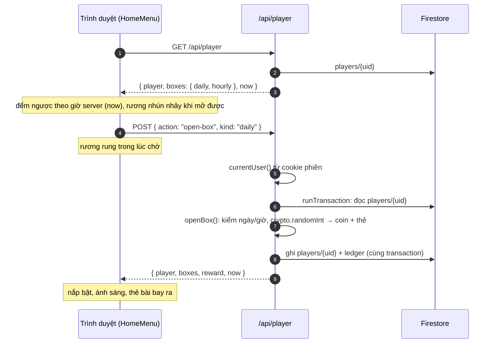

Mở hộp lần hai trong ngày, nâng sao thiếu thẻ, mua thiếu coin… trả `409` kèm thông báo; không ghi gì.

### 6.4 Giao diện

| Chỗ | Nội dung |
| --- | --- |
| Góc trên phải `/` và `/play` (trừ lúc đang đánh) | avatar (ảnh tài khoản hoặc DiceBear `clay` theo uid), tên, thanh coin; bấm avatar: CMS (admin), đăng xuất |
| Góc dưới trái `/` | hộp quà hằng ngày, hộp x giờ (sau khi mở hộp hằng ngày), bộ sưu tập thẻ |
| Màn mở hộp | [ChestStage](../src/components/player/ChestStage.tsx): rương idle nhún nhảy + lắc lư, rung khi chờ server, nắp bật theo bản lề, quầng sáng, cột sáng, tia sáng xoay, hạt lấp lánh; sau đó coin và thẻ bài bật ra |
| Bộ sưu tập thẻ | thẻ kiểu Clash Royale (khung xanh sọc, giọt chi phí, tấm gỗ tên, sao, thanh thẻ `có/cần`), khóa + giá; chi tiết: chỉ số trước/sau khi lên sao, mở khóa / nâng sao / mua 10–50 thẻ (bấm hai lần để xác nhận trừ coin) |
| Bảng lính khi xếp quân | lính chưa mở khóa mờ + ổ khóa, không đặt được, "Ngẫu nhiên" chỉ dùng lính đã có; hiện số sao khi sao được tính |
| `/models` | tab 🃏 Thẻ & sao cho từng lính (có thẻ xem trước); mục Hộp quà xem 6 kiểu rương và *Mở thử* |
| CMS `/admin/users/{uid}` | ví, lính đã mua, sao, sổ giao dịch 50 dòng gần nhất, cộng/trừ coin có lý do |

Font: mọi màn game (không gồm `/admin` và `/models`) dùng lớp `.game-ui`: font Clash từ `data/Clash_Regular.otf.ttf` (phục vụ qua `/api/fonts/clash`, thay file là có hiệu lực, thiếu file thì dùng font dự phòng), chữ màu `#2D3232`, cỡ tối thiểu 16px (`text-xs`/`text-sm` = 16px trong `.game-ui`). File Clash hiện thiếu phần lớn chữ tiếng Việt có dấu chồng (ơ ư ạ ả ấ ầ…), các chữ đó lấy từ Paytone One cho tới khi có bản Clash tiếng Việt.

---

## 7. Chế độ xếp hạng và chống cày thắng

Xếp hạng (`/play?mode=ranked`) là đấu online 1v1 có ghép trận tự động, bậc/hạng/kim cương kiểu Pokemon Unite, mùa giải, bảng xếp hạng và phần thưởng. Vì có thưởng, xếp hạng là nơi phải chặn việc **một người dùng tài khoản phụ đánh nhường cho tài khoản chính**. Server không chạy lại trận (mục 3.7) nên không phân biệt được trận thật với trận nhường; thay vào đó, các lớp dưới đây làm việc nhường trận không còn lời.

Luật thuần ở [src/shared/ranked.ts](../src/shared/ranked.ts), có test ([ranked.test.ts](../src/shared/ranked.test.ts)); Firestore ở [src/server/ranked.ts](../src/server/ranked.ts); hàng chờ và phòng ở [rooms.ts](../src/server/rooms.ts).

### 7.1 Bậc, hạng, kim cương

Mặc định (chỉnh trong CMS, mục 7.6):

| Bậc | Số hạng | ♦ mỗi hạng | Thua mất ♦ | Rương cuối mùa |
| --- | --- | --- | --- | --- |
| Tân Binh | 3 | 3 | không | gỗ, 5–10 coin, 20 thẻ |
| Tinh Nhuệ | 4 | 4 | có | bạc, 10–20 coin, 40 thẻ |
| Cao Thủ | 5 | 4 | có | vàng, 20–40 coin, 60 thẻ |
| Kỳ Cựu | 5 | 5 | có | khổng lồ, 40–80 coin, 100 thẻ |
| Siêu Việt | 5 | 5 | có | phép thuật, 80–150 coin, 160 thẻ |
| Bậc Thầy | — | điểm 0–99999 (+20 / −20) | có | siêu phép thuật, 150–300 coin, 250 thẻ |

- **Thắng** +1 ♦. Thắng khi hạng đã đủ ♦ thì lên hạng kế tiếp với 0 ♦ (hết hạng thì lên bậc trên, Siêu Việt lên Bậc Thầy).
- **Thua** −1 ♦. Thua khi hạng còn 0 ♦ thì xuống hạng dưới với đủ ♦, kể cả **rớt bậc**. Bậc có `loseDiamond` tắt (mặc định Tân Binh) thì thua không mất gì. Một trận thắng rồi một trận thua luôn về đúng chỗ cũ.
- **Bậc Thầy** cộng/trừ điểm; về 0 điểm mà thua tiếp thì rớt về hạng cao nhất của Siêu Việt.
- **Hòa** không đổi ♦.
- Bảng xếp hạng sắp theo `score` = thứ tự bậc × 1.000.000 + vị trí trong bậc (hạng/♦ hoặc điểm Bậc Thầy). Ghép trận đo khoảng cách bằng *số bước* (mỗi trận thắng một bước).

### 7.2 Mùa giải

- Mùa tự nối tiếp từ `ranked.seasonStart` (0h giờ Việt Nam), mỗi mùa `seasonDays` ngày; id `s1`, `s2`… Không cần admin bấm sang mùa. Đổi `seasonStart` hoặc `seasonDays` sẽ đổi số mùa hiện tại.
- Hạng lưu kèm id mùa. Lần đầu server thấy người chơi ở mùa mới: mùa cũ kết thúc. Nếu mùa cũ có đánh ít nhất một trận thì có **rương cuối mùa** theo bậc cuối mùa, phải nhận (`rank-claim`) trước khi vào hàng chờ. Mùa mới bắt đầu ở bậc cũ trừ `seasonResetTiers` (mặc định 1), hạng 1, 0 ♦.
- Trận bắt đầu ở mùa cũ nhưng kết thúc khi mùa mới đã sang thì không tính.

### 7.3 Ghép trận và phòng xếp hạng

Điều kiện vào hàng chờ (`rankedGate`): phiên hợp lệ, xếp hạng đang bật và đang có mùa, tài khoản ≥ `minAccountDays` ngày tuổi, đã nhận thưởng thắng bot ≥ `minBotWins` lần (`botWinTotal`), không còn rương mùa trước chưa nhận, số tranh chấp mùa này < `maxDisputes`.

Hàng chờ nằm trong RAM (uid → socket, IP, số bước, lúc vào). Mỗi 2 giây và mỗi khi có người vào, `pickPairs` ghép người chờ lâu nhất với người có hạng gần nhất trong khoảng cho phép `matchGap + matchGapGrowth × (số lần 10 giây đã chờ)`; bỏ qua hai người cùng IP (`blockSameIp`) và cặp đã đủ `pairDailyLimit` trận hôm nay. IP lấy từ header `cf-connecting-ip` (Cloudflare Tunnel), không có thì lấy địa chỉ socket.

Ghép xong, server tạo **phòng xếp hạng**: mã ngẫu nhiên, bản đồ ngẫu nhiên trong `ranked.mapIds` (trống = mọi bản đồ), ngân sách của bản đồ, tính sao, đại chiến, hai chỗ `blue`/`red` đã xếp sẵn. Phòng này không đổi được cài đặt, không vào được bằng mã (trừ chính hai người, khi rớt mạng), chỉ đánh **một trận**. Rời phòng trước khi trận bắt đầu thì hủy ghép cho cả hai (`rank:cancelled`), không phạt. Phần còn lại (30 giây xếp quân, `room:ready`, `battle:start`, checksum, báo kết thúc, đầu hàng) giống phòng thường (mục 3).

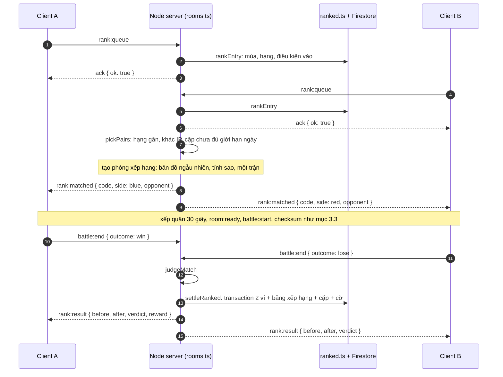

### 7.4 Dữ liệu Firestore

| Nơi | Trường | Ý nghĩa |
| --- | --- | --- |
| `players/{uid}.ranked` | `season`, `tier`, `cls`, `diamonds`, `points` | mùa, bậc, hạng, ♦, điểm Bậc Thầy |
| | `wins`, `losses`, `draws`, `disputes` | thành tích mùa, số trận tranh chấp |
| | `rewardDay`, `rewardsToday` | số rương thắng đã nhận hôm nay |
| `ranked_seasons/{season}/standings/{uid}` | `name`, `tier`, `cls`, `diamonds`, `points`, `wins`, `losses`, `score`, `updatedAt` | bản sao cho bảng xếp hạng (`orderBy('score')`, chỉ cần index một trường) |
| `ranked_pairs/{uidA__uidB}` | `day`, `count` | số trận xếp hạng hôm nay của cặp tài khoản (uid xếp theo thứ tự) |
| `ranked_flags/{autoId}` | `at`, `season`, `room`, `flags`, `winner`, `ended`, `durationMs`, `budget`, `pairCount`, `players.{side}.{uid, name, ip, armyCost}`, `reviewed`, `reviewedBy` | trận đáng ngờ cho admin. Có lưu IP (dữ liệu cá nhân): chỉ server và trang admin đọc |

Tất cả chỉ server ghi (Admin SDK); Firestore rules không mở cho client. Trận xếp hạng vẫn được lưu vào `matches` như phòng thường, có thêm `ranked` = id mùa.

### 7.5 Chốt kết quả và chống acc phụ

Kết thúc trận có ba kiểu: hai máy báo khớp (`report`), đầu hàng / mất kết nối (`forfeit`, server xử thắng ngay), hoặc bị hủy (báo lệch, desync, thiếu checksum, báo sai định dạng). `settleRanked` đọc số trận hôm nay của cặp và hai ví **trong cùng một transaction**, áp `judgeRanked`, rồi ghi hai ví (kèm dòng sổ `rank-win` khi có rương), hai dòng bảng xếp hạng, bộ đếm cặp (trừ trận bị hủy) và cờ nếu có.

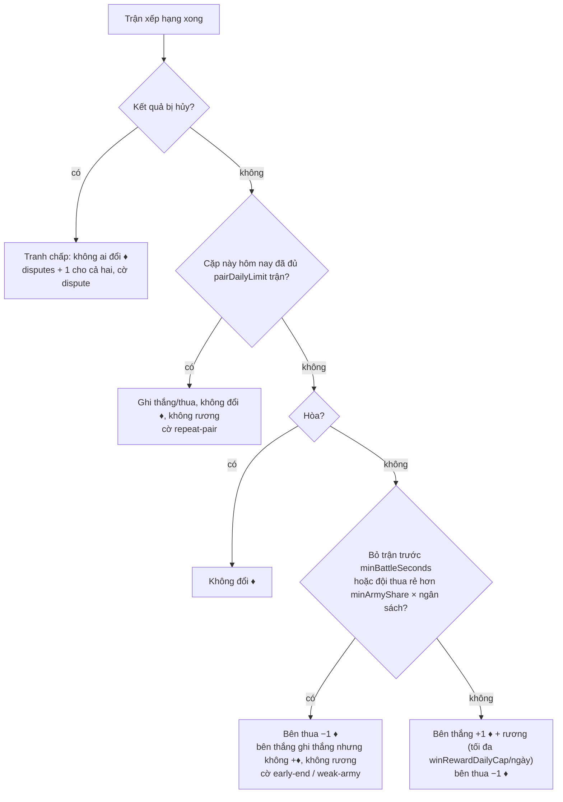

Hai người cùng IP chỉ bị gắn cờ `same-ip` để admin xem (ghép trận đã tránh cùng IP khi `blockSameIp` bật).

| Lớp | Chặn cái gì | Cài đặt |
| --- | --- | --- |
| Chỉ ghép tự động, không vào bằng mã | tự chọn acc phụ làm đối thủ; hai acc phải vào hàng chờ cùng lúc với hạng gần nhau, và dễ bị ghép với người khác | — |
| Tuổi tài khoản + số lần thắng bot | tạo hàng loạt acc phụ mới | `minAccountDays` (3), `minBotWins` (10) |
| Không ghép cùng IP | acc chính và phụ trên cùng máy / cùng mạng | `blockSameIp` |
| Giới hạn cặp mỗi ngày | cày liên tục với một acc phụ | `pairDailyLimit` (2) |
| Bỏ trận sớm: bên thắng không được ♦ | acc phụ vào trận rồi đầu hàng / thoát ngay | `minBattleSeconds` (30) |
| Đội thua quá rẻ: bên thắng không được ♦ | acc phụ đặt vài lính cho thua nhanh | `minArmyShare` (0,5) |
| Giới hạn rương thắng mỗi ngày | đổi chuỗi thắng ra coin/thẻ | `winRewardDailyCap` (20) |
| Khóa xếp hạng khi quá nhiều tranh chấp | người gian lận một mình khai thắng khi đang thua để hủy trận thua | `maxDisputes` (5); admin mở khóa |
| Cờ + trang `/admin/ranked` | để admin tìm các cặp tài khoản lặp lại | — |

**Giới hạn còn lại:** acc phụ đủ tuổi, khác IP, đặt đội đủ tiền nhưng cố tình yếu rồi thua sau 30 giây vẫn cho acc chính +1 ♦, tối đa `pairDailyLimit` lần/ngày cho mỗi acc phụ. Người thắng thật khi đối thủ AFK hoặc bỏ trận sớm cũng không được ♦. Chặn hẳn cần server chạy lại trận (mục 3.7).

### 7.6 Cài đặt CMS

`settings/global.ranked`, sửa ở CMS *Cài đặt* (ba mục Xếp hạng):

| Trường | Mặc định | Ý nghĩa |
| --- | --- | --- |
| `enabled` | `true` | bật chế độ xếp hạng |
| `seasonStart`, `seasonDays` | `2026-09-01`, 30 | ngày bắt đầu Mùa 1 (giờ Việt Nam), độ dài mỗi mùa |
| `seasonResetTiers` | 1 | số bậc bị tụt khi sang mùa mới |
| `tiers.{beginner…master}` | bảng 7.1 | tên, số hạng, ♦ mỗi hạng, thua có mất ♦, rương cuối mùa |
| `masterWin`, `masterLoss` | 20, 20 | điểm Bậc Thầy mỗi trận |
| `mapIds` | `[]` | bản đồ dùng cho xếp hạng (trống = tất cả) |
| `winBox`, `winRewardDailyCap` | gỗ 2–5 coin 10 thẻ, 20 | rương mỗi trận thắng được tính, số rương/ngày |
| `minAccountDays`, `minBotWins` | 3, 10 | điều kiện vào hàng chờ |
| `pairDailyLimit` | 2 | số trận/ngày của cùng hai tài khoản còn được tính |
| `minBattleSeconds`, `minArmyShare` | 30, 0,5 | bỏ trận sớm / đội quá rẻ thì bên thắng không được ♦ |
| `blockSameIp` | `true` | không ghép hai người cùng IP |
| `maxDisputes` | 5 | số tranh chấp/mùa trước khi khóa xếp hạng |
| `matchGap`, `matchGapGrowth` | 6, 3 | chênh lệch tối đa (bước) khi ghép, nới thêm mỗi 10 giây chờ |

Firestore đang có dữ liệu không cần migrate: thiếu `ranked` thì server dùng mặc định.

### 7.7 Giao diện

| Chỗ | Nội dung |
| --- | --- |
| Màn chính `/` | thẻ chế độ thứ tư *Xếp hạng* |
| Sảnh xếp hạng | dải huy hiệu 6 bậc (bậc hiện tại nổi lên, bậc chưa tới mờ), bậc + hạng + ♦, thắng/thua, rương mùa trước, lý do chưa được vào, *Tìm trận* / đang tìm + đếm giây + *Hủy*, *Bảng xếp hạng* (top 50 + vị trí của mình) |
| Xếp quân | panel đối thủ (tên, huy hiệu, hạng, sẵn sàng), đếm ngược, bản đồ và ngân sách cố định |
| Kết quả | huy hiệu trước → sau, ▲/▼, lên/rớt bậc, lý do không được ♦, rương; *Tìm trận mới* về sảnh |
| CMS `/admin/ranked` | trận bị gắn cờ (chưa xem / đã xem): người chơi, uid, IP, giá đội / ngân sách, thời lượng, trận thứ mấy của cặp; *Đã xem*, *Mở khóa rank* (đặt `disputes` về 0) |

Huy hiệu là SVG trong [ranked.tsx](../src/components/game/ranked.tsx): cúp + đá quý, màu theo bậc, cánh từ Kỳ Cựu, vương miện ở Bậc Thầy.

---

## 8. Phụ lục: bảng API

| Method | Đường dẫn | Quyền | Mô tả |
| --- | --- | --- | --- |
| GET | `/api/config` | công khai | bundle nội dung + `version` cho game |
| GET | `/api/auth/session` | công khai | hồ sơ hiện tại hoặc `null` |
| POST | `/api/auth/session` | công khai (cần idToken hợp lệ) | đổi idToken lấy cookie phiên, tạo/cập nhật hồ sơ |
| DELETE | `/api/auth/session` | công khai | xóa cookie phiên |
| POST | `/api/auth/fcm` | user đăng nhập | lưu FCM token của thiết bị |
| GET | `/api/player` | công khai (`player: null` khi chưa đăng nhập) | ví của mình + trạng thái hộp quà + giờ server |
| POST | `/api/player` | user đăng nhập | `{action:"open-box", kind}` / `{action:"unlock"\|"upgrade", unitId}` / `{action:"buy-cards", unitId, count}` / `{action:"bot-start", botId, botCount}` / `{action:"bot-win"}` / `{action:"rank-claim"}`; trả ví mới (+ `reward` khi mở hộp, thắng bot, nhận thưởng mùa) |
| GET | `/api/ranked` | user đăng nhập | sảnh xếp hạng: `{ season, rank, pending, gate, botWins, now }` |
| GET | `/api/ranked?board={season}` | user đăng nhập | bảng xếp hạng: `{ rows (top 50), me }` |
| GET | `/api/fonts/clash` | công khai | file font `data/Clash_Regular.otf.ttf` (204 khi thiếu — font tùy chọn, không tính là lỗi) |
| GET / POST | `/api/admin/{collection}` | root/admin | liệt kê / tạo tài liệu |
| GET / PUT / DELETE | `/api/admin/{collection}/{id}` | root/admin | đọc / sửa / xóa (chặn khi còn phụ thuộc) |
| GET / PUT | `/api/admin/settings` | root/admin | cài đặt game |
| GET / PUT / POST | `/api/admin/bundle` | root/admin | tải bundle JSON / nhập thay toàn bộ / `{action:"reset"}` / `{action:"merge", docs, skills, prices}` thêm nội dung mặc định còn thiếu, gán kỹ năng / giá mặc định cho lính mặc định chưa có (không sửa mục khác) |
| GET / POST | `/api/admin/studio` | root/admin | trạng thái engine + danh sách job / tạo job |
| GET / DELETE | `/api/admin/studio/{id}` | root/admin | chi tiết job / xóa job (không khi đang chạy) |
| POST | `/api/admin/studio/{id}/run` | root/admin | chạy bước `spec` / `review` (stream NDJSON) hoặc `stop` |
| POST | `/api/admin/studio/codegen` | root/admin | sinh file TypeScript từ sculpt spec (version hoặc asset đã áp dụng) |
| GET / POST | `/api/admin/users` | root/admin | danh sách / tạo user (giới hạn role cấp được) |
| GET / PATCH / DELETE | `/api/admin/users/{uid}` | root/admin + `canManage` cho PATCH/DELETE | xem / sửa / xóa user (xóa cả ví `players/{uid}` và ledger) |
| POST | `/api/admin/users/{uid}/notify` | root/admin | gửi push FCM tới mọi thiết bị của user |
| GET | `/api/admin/users/{uid}/wallet` | root/admin | ví + trạng thái hộp + 50 dòng ledger gần nhất |
| POST | `/api/admin/users/{uid}/wallet` | root/admin + `canManage` | `{ delta, note }` cộng/trừ coin (không âm), ghi ledger `admin` |
| GET | `/api/admin/ranked?reviewed=0\|1` | root/admin | trận xếp hạng bị gắn cờ (200 gần nhất) |
| POST | `/api/admin/ranked` | root/admin | `{action:"review", id}` đánh dấu đã xem / `{action:"clear-disputes", uid}` mở khóa xếp hạng |
| WS | `/socket.io` | user đăng nhập, cùng origin | PvP online và xếp hạng, xem mục 3 và 7 |
