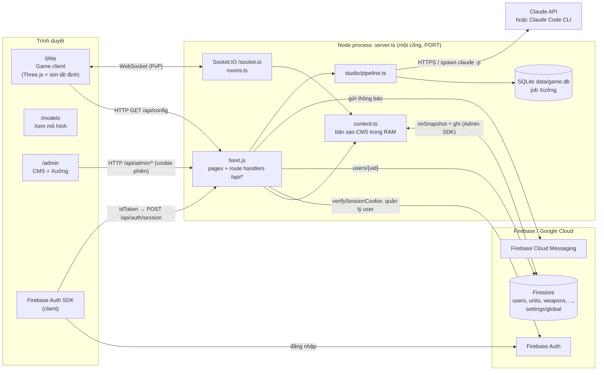
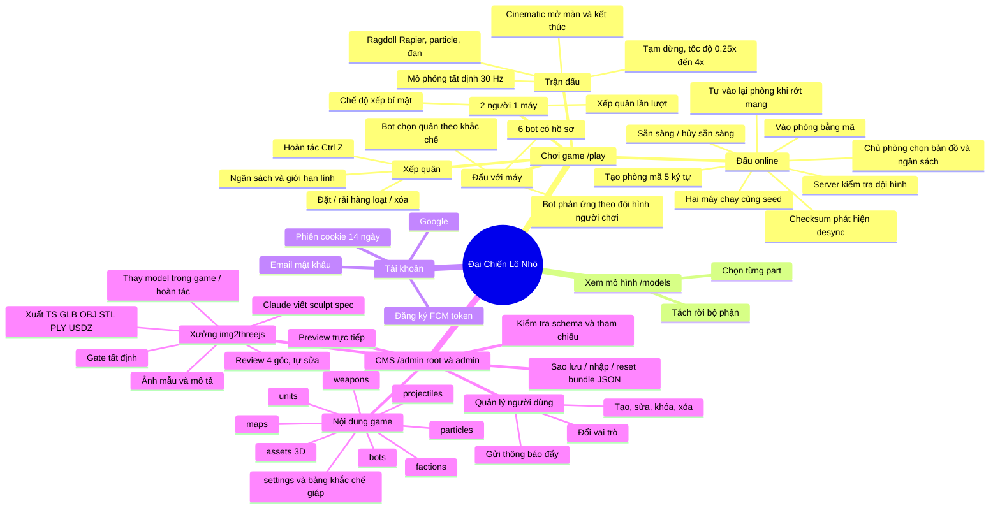
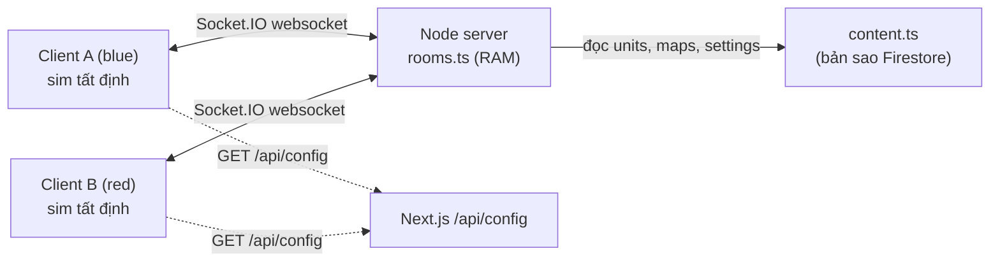
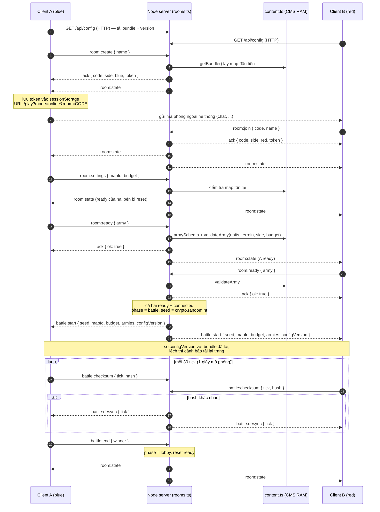
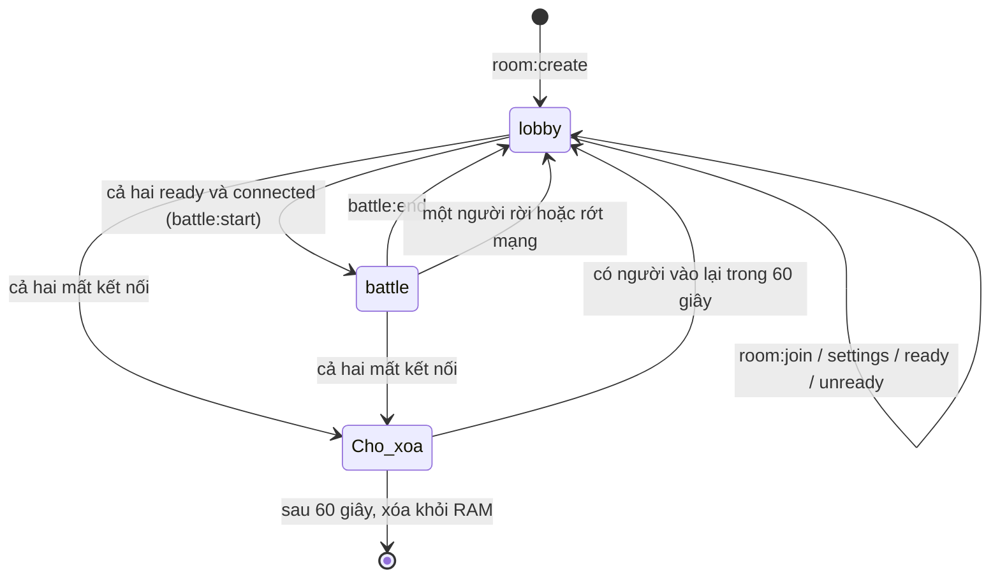
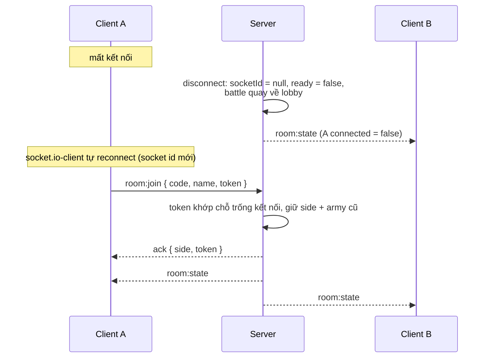
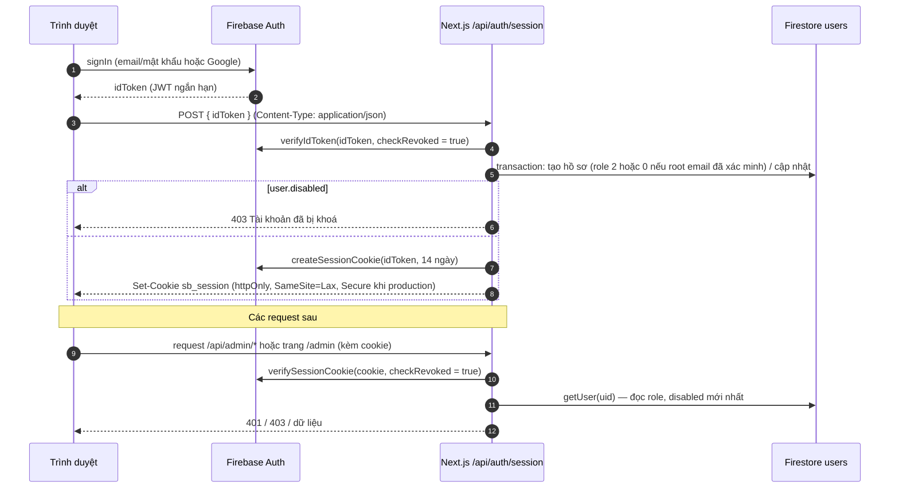
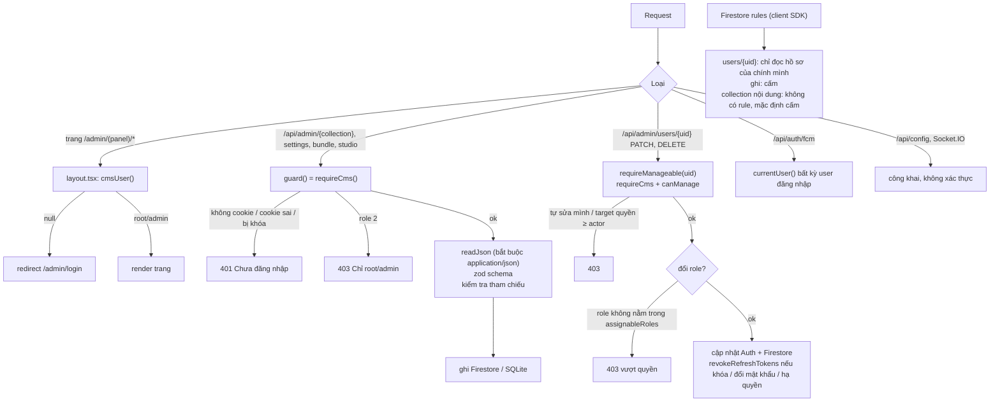

# Đại Chiến Lô Nhô — Tài liệu kiến trúc, PvP online, phân quyền và bảo mật

Tài liệu mô tả hệ thống theo code hiện tại (Next.js 16 + Socket.IO trong một tiến trình Node, Firebase Auth/Firestore/FCM, SQLite, Claude API/CLI). Sơ đồ viết bằng Mermaid, xem được trực tiếp trên GitHub/VS Code.

Mục lục:

1. [Tổng quan hệ thống](#1-tổng-quan-hệ-thống)
2. [Sơ đồ tất cả tính năng](#2-sơ-đồ-tất-cả-tính-năng)
3. [Giao tiếp cho tính năng người vs người (online)](#3-giao-tiếp-cho-tính-năng-người-vs-người-online)
4. [Cơ chế phân quyền](#4-cơ-chế-phân-quyền)
5. [Bảo mật](#5-bảo-mật)
6. [Phụ lục: bảng API](#6-phụ-lục-bảng-api)

---

## 1. Tổng quan hệ thống

Điểm chính:

- **Một tiến trình Node** chạy cả Next.js và Socket.IO trên cùng cổng. Không có microservice, không có server-to-server giữa các node game. Muốn chạy nhiều instance cần thêm adapter (Redis) cho Socket.IO và sticky session — hiện **chưa có**.
- **Giao tiếp server-to-server** thực tế chỉ có: Node ↔ Firebase (Auth, Firestore, FCM qua Admin SDK) và Node ↔ Anthropic (Claude API) hoặc tiến trình con `claude` CLI.
- **Nội dung CMS** là nguồn chuẩn cho cả game, bot và kiểm tra đội hình online. Server giữ bản sao RAM qua snapshot listener; sửa trên CMS hay Firebase Console đều áp dụng từ trận sau.

---

## 2. Sơ đồ tất cả tính năng

Bảng tính năng theo module code:

| Nhóm | Tính năng | Code chính |
| --- | --- | --- |
| Game | 3 chế độ `ai` / `local` / `online` | [GameClient.tsx](../src/components/game/GameClient.tsx) |
| Game | Mô phỏng tất định, checksum | [world.ts](../src/game/sim/world.ts), [engine.ts](../src/game/render/engine.ts) |
| Game | Kiểm tra đội hình (dùng chung client + server) | [army.ts](../src/game/sim/army.ts) |
| Game | Bot | [generate.ts](../src/game/bot/generate.ts) |
| Online | Phòng, sẵn sàng, bắt đầu trận, desync | [rooms.ts](../src/server/rooms.ts), [net.ts](../src/shared/net.ts), [client.ts](../src/game/net/client.ts) |
| Nội dung | Firestore + bản sao RAM + seed | [content.ts](../src/server/content.ts), [schema.ts](../src/shared/schema.ts) |
| Tài khoản | Phiên, hồ sơ, vai trò | [users.ts](../src/server/users.ts), [shared/users.ts](../src/shared/users.ts), [session route](../src/app/api/auth/session/route.ts) |
| CMS | CRUD collection, settings, bundle | [src/app/api/admin/](../src/app/api/admin/) |
| CMS | Quản lý user, FCM | [users routes](../src/app/api/admin/users/), [userAdmin.ts](../src/server/userAdmin.ts) |
| Xưởng | Pipeline Claude, gate, xuất file | [studio/](../src/server/studio/), [sculpt/](../src/game/sculpt/) |

---

## 3. Giao tiếp cho tính năng người vs người (online)

### 3.1 Mô hình: server làm trọng tài lobby, không mô phỏng

Hai người chơi **không nói chuyện trực tiếp với nhau** (không P2P/WebRTC) và **không có server-to-server**. Luồng là **Client A ↔ Node server ↔ Client B** qua Socket.IO (chỉ transport `websocket`).

Server **không chạy trận**. Server làm 4 việc:

1. Quản lý phòng (tạo, vào, chỗ ngồi `blue`/`red`, token vào lại).
2. Kiểm tra đội hình theo dữ liệu CMS (schema, lính tồn tại, trong vùng triển khai, số lính, ngân sách).
3. Khi cả hai sẵn sàng: sinh `seed` bằng `crypto.randomInt`, gửi `battle:start` gồm seed + hai đội hình + `configVersion`.
4. So checksum mỗi 30 tick (1 giây mô phỏng) từ hai bên, lệch thì báo `battle:desync`.

Hai trình duyệt tự chạy cùng một trận. Mô phỏng chỉ dùng `+ - * /`, `Math.sqrt` và PRNG có seed, nên kết quả trùng từng bit.

### 3.2 Giao thức sự kiện

Định nghĩa ở [src/shared/net.ts](../src/shared/net.ts).

Client → Server:

| Sự kiện | Payload | Ack | Điều kiện server chấp nhận |
| --- | --- | --- | --- |
| `room:create` | `{ name }` | `{ ok, code, side, token }` | tên 1–20 ký tự, CMS có ít nhất 1 map |
| `room:join` | `{ code, name, token? }` | `{ ok, code, side, token }` | phòng tồn tại; có token khớp chỗ đang trống kết nối, hoặc còn chỗ `red` |
| `room:settings` | `{ mapId, budget }` | — | chỉ `blue` (chủ phòng), phase `lobby`, map tồn tại, budget 100–1.000.000 |
| `room:ready` | `{ army: Placement[] }` | `{ ok }` / `{ ok:false, error }` | phase `lobby`, `armySchema` (≤ 500), `validateArmy` pass, không rỗng |
| `room:unready` | — | — | phase `lobby` |
| `battle:checksum` | `{ tick, hash }` | — | phase `battle`, tick nguyên, hash hữu hạn |
| `battle:end` | `{ winner }` | — | phase `battle` |
| `room:leave` / `disconnect` | — | — | luôn |

Server → Client:

| Sự kiện | Payload | Khi nào |
| --- | --- | --- |
| `room:state` | `{ code, phase, mapId, budget, players: { name, ready, connected, units, cost } }` | mọi thay đổi phòng (gửi cả phòng) |
| `battle:start` | `{ seed, mapId, budget, armies: { blue, red }, configVersion }` | cả hai `ready` và cùng đang kết nối |
| `battle:desync` | `{ tick }` | hash hai bên khác nhau tại cùng tick |

Lưu ý: `room:state` **chỉ lộ số lính và tổng chi phí**, không lộ vị trí/loại lính. Đội hình đối thủ chỉ gửi xuống lúc `battle:start`.

### 3.3 Trình tự một trận

### 3.4 Vòng đời phòng

### 3.5 Rớt mạng và vào lại

- Token 24 ký tự hex (`randomBytes(12)`), lưu `sessionStorage` theo mã phòng, dùng để giành lại đúng chỗ ngồi.
- Không có token hoặc token sai: chỉ được vào chỗ `red` còn trống.
- Trạng thái phòng chỉ nằm trong RAM: **khởi động lại server là mất mọi phòng**.

---

## 4. Cơ chế phân quyền

### 4.1 Vai trò

Lưu ở Firestore `users/{uid}.role` ([src/shared/users.ts](../src/shared/users.ts)):

| Giá trị | Vai trò | Quyền |
| --- | --- | --- |
| `0` | Root | toàn quyền CMS, quản lý mọi user khác (kể cả root/admin khác), cấp mọi vai trò |
| `1` | Admin | toàn quyền nội dung CMS + Xưởng; chỉ quản lý user role `2`; chỉ cấp role `2` |
| `2` | Người dùng | chơi game, đăng ký FCM token; không vào `/admin` |
| — | Khách (chưa đăng nhập) | chơi mọi chế độ kể cả online, xem `/models`, đọc `/api/config` |

Quy tắc (hàm thuần, dùng chung):

- `canAccessCms(user)`: đăng nhập, không bị khóa, `role <= 1`.
- `canManage(actor, target)`: không tự sửa chính mình; root quản lý tất cả; người khác chỉ quản lý người có `role` lớn hơn (thấp quyền hơn).
- `assignableRoles(actor)`: root cấp `0,1,2`; admin chỉ cấp `2`.
- Root đầu tiên: email trong `FIREBASE_ROOT_EMAILS` **và đã xác minh** (`emailVerified`) → mỗi lần đăng nhập được đặt `role = 0`.

### 4.2 Luồng xác thực

### 4.3 Kiểm tra quyền trên từng lớp

Ma trận quyền theo endpoint:

| Endpoint | Khách | User (2) | Admin (1) | Root (0) |
| --- | --- | --- | --- | --- |
| `GET /api/config` | ✓ | ✓ | ✓ | ✓ |
| Socket.IO `/socket.io` (PvP) | ✓ | ✓ | ✓ | ✓ |
| `GET/POST/DELETE /api/auth/session` | ✓ | ✓ | ✓ | ✓ |
| `POST /api/auth/fcm` | ✗ | ✓ | ✓ | ✓ |
| Trang `/admin/*` | ✗ | ✗ | ✓ | ✓ |
| `/api/admin/{collection}[/{id}]`, `settings`, `bundle` | ✗ | ✗ | ✓ | ✓ |
| `/api/admin/studio/**` (gọi Claude, tốn chi phí) | ✗ | ✗ | ✓ | ✓ |
| `GET /api/admin/users[/{uid}]` | ✗ | ✗ | ✓ (xem tất cả) | ✓ |
| `POST /api/admin/users` | ✗ | ✗ | chỉ tạo role 2 | mọi role |
| `PATCH/DELETE /api/admin/users/{uid}` | ✗ | ✗ | chỉ target role 2, không phải mình | mọi target trừ mình |
| `POST /api/admin/users/{uid}/notify` | ✗ | ✗ | ✓ (mọi user) | ✓ |

---

## 5. Bảo mật

### 5.1 Các biện pháp đang có

**Xác thực, phiên**

- Phiên dùng Firebase **session cookie** `sb_session`: `httpOnly` (JS không đọc được), `SameSite=Lax`, `Secure` ở production, tối đa 14 ngày.
- `verifyIdToken` và `verifySessionCookie` đều bật `checkRevoked`. Khóa user, đổi mật khẩu hoặc hạ quyền sẽ gọi `revokeRefreshTokens`, nên cookie cũ mất hiệu lực ngay.
- Mỗi request đọc lại hồ sơ Firestore, nên đổi `role`/`disabled` áp dụng tức thì, không phụ thuộc token cũ.
- Root bootstrap chỉ nhận **email đã xác minh**, tránh việc tạo tài khoản email/mật khẩu chưa xác minh trùng email root.

**Chống CSRF**

- Cookie `SameSite=Lax`: request cross-site bằng `fetch`/form POST không kèm cookie.
- `readJson` bắt buộc `Content-Type: application/json` cho mọi thao tác ghi, chặn form HTML cross-site (form không gửi được JSON content type mà không qua preflight CORS).

**Kiểm tra dữ liệu vào**

- Mọi payload API và Socket.IO đi qua **zod** (`COLLECTION_SCHEMAS`, `settingsSchema`, `armySchema`, `createUserSchema`, ...). Không đổi được `id` qua PUT.
- Kiểm tra tham chiếu chéo (`findRefIssues`) khi tạo/sửa/nhập, chặn xóa khi còn phụ thuộc (`findDependents`).
- Tài liệu Firestore sửa tay sai schema bị bỏ qua và ghi log, không làm hỏng game.
- Giới hạn kích thước: ảnh Xưởng ≤ 12 MB dạng data URL PNG/JPEG/WebP/GIF, sheet review ≤ 8 MB, prompt ≤ 4000 ký tự, idToken ≤ 4096.

**Firestore**

- Client SDK chỉ đọc được `users/{uid}` của chính mình; mọi ghi đi qua server (Admin SDK). Collection nội dung không có rule nên client bị chặn mặc định; game đọc qua `/api/config`.
- Service account chỉ nằm ở biến môi trường server (`FIREBASE_SERVICE_ACCOUNT`), không có tiền tố `NEXT_PUBLIC_`.

**PvP online**

- Server là nguồn chuẩn cho **luật xếp quân**: đội hình bị kiểm tra lại bằng `validateArmy` với dữ liệu CMS trên server (lính tồn tại, vùng triển khai, số lính tối đa, ngân sách). Client sửa UI cũng không vượt được.
- Seed sinh bằng `crypto.randomInt` trên server; mã phòng và token dùng `node:crypto`.
- Đội hình đối thủ không lộ trong lobby (`room:state` chỉ có số lính và chi phí).
- Chỉ chủ phòng (`blue`) đổi được map/ngân sách, và mọi thay đổi reset trạng thái sẵn sàng của hai bên.
- Bộ nhớ checksum mỗi phòng giới hạn 200 mục; phòng trống tự xóa sau 60 giây.
- `configVersion` (hash SHA-1 của nội dung) giúp phát hiện hai máy dùng dữ liệu CMS khác nhau.

**Xưởng img2threejs (AI)**

- Claude **chỉ trả JSON sculpt spec**, không trả code. Spec được parse bằng schema và dựng bởi generator tin cậy trong [src/game/sculpt](../src/game/sculpt/); không có `eval`/`new Function` nào chạy nội dung AI.
- CLI chạy với `--safe-mode --tools ""` (không tool, không đọc CLAUDE.md/hook/MCP), `cwd` là thư mục tạm, không lưu session.
- `ANTHROPIC_API_KEY` chỉ ở server. Chỉ root/admin gọi được Xưởng.

**Khác**

- Nội dung do người dùng nhập (tên người chơi, tên hiển thị) render qua React nên được escape tự động.
- Lỗi Firebase được map sang thông báo thân thiện; lỗi không xác định vẫn trả `e.message` (xem 5.2).

### 5.2 Rủi ro và điểm cần lưu ý

Xếp theo mức độ ưu tiên khuyến nghị. Đây là nhận định từ đọc code, chưa pentest.

| # | Mức | Vấn đề | Chi tiết | Hướng xử lý gợi ý |
| --- | --- | --- | --- | --- |
| 1 | Trung bình | **Socket.IO không xác thực, không giới hạn tốc độ** | Ai cũng kết nối được và gọi `room:create` liên tục; mỗi phòng chiếm RAM đến khi socket rời. Không có giới hạn số phòng/IP hay số sự kiện/giây. `room:ready` chạy `validateArmy` (≤ 500 lính) mỗi lần gọi. | Giới hạn phòng mỗi socket/IP, rate limit sự kiện, `maxHttpBufferSize` nhỏ, giới hạn tổng số phòng. |
| 2 | Trung bình | **Kết quả trận do client quyết định** | `battle:end` từ **một** bên là đủ đưa phòng về lobby; `winner` không được kiểm chứng. Checksum chỉ **báo** desync, không chặn gian lận. Hiện chưa lưu thắng/thua nên tác động thấp; nếu thêm xếp hạng thì phải chạy lại mô phỏng trên server (tất định nên làm được) hoặc yêu cầu hai bên đồng thuận. | Trước khi có bảng xếp hạng: server tự mô phỏng từ seed + armies để ra kết quả chuẩn. |
| 3 | Trung bình | **Không giới hạn origin cho WebSocket** | Transport `websocket` không chịu CORS; trang bất kỳ có thể mở kết nối tới server. Không có cookie/phiên dùng trong socket nên không lộ dữ liệu, nhưng tiếp tay cho mục 1. | Kiểm tra `Origin` trong `allowRequest` của Socket.IO. |
| 4 | Thấp–TB | **Không có security header** | Chưa đặt CSP, `X-Frame-Options`/`frame-ancestors`, `Referrer-Policy`, HSTS trong [next.config.ts](../next.config.ts). `/admin` có thể bị nhúng iframe (clickjacking). | Thêm `headers()` trong Next config hoặc ở reverse proxy. |
| 5 | Thấp–TB | **Không rate limit API** | `/api/auth/session` và các route admin không giới hạn tốc độ. Firebase Auth có chống brute force phía client, nhưng Xưởng có thể bị gọi dồn gây tốn chi phí Claude nếu tài khoản admin bị lộ. | Rate limit theo IP/uid ở reverse proxy hoặc middleware; giới hạn số job chạy song song. |
| 6 | Thấp | **Guard nằm rải rác trong từng route** | Không có `middleware`/`proxy` chung cho `/api/admin/*`; route mới quên gọi `guard()` sẽ mở công khai. | Thêm middleware kiểm tra cookie cho `/api/admin` (lớp 1) và giữ `guard()` (lớp 2); thêm test liệt kê route. |
| 7 | Thấp | **Root theo biến môi trường luôn được nâng lại** | Email trong `FIREBASE_ROOT_EMAILS` được đặt `role = 0` **mỗi lần đăng nhập**; hạ quyền trong CMS sẽ bị hoàn tác. Nếu tài khoản Google đó bị chiếm, không hạ quyền được bằng CMS (chỉ khóa `disabled` được, và chỉ root khác làm được). | Gỡ email khỏi biến môi trường sau khi bootstrap. |
| 8 | Thấp | **Admin gửi thông báo tới mọi user** | `notify` chỉ dùng `requireCms`, không dùng `canManage`: admin gửi được push tới root/admin khác. `GET /api/admin/users` trả cả `fcmTokens` cho admin. | Dùng `requireManageable` cho notify; ẩn `fcmTokens` trong response danh sách. |
| 9 | Thấp | **Token vào lại phòng lưu `sessionStorage`** | XSS trên trang (nếu có) đọc được token và chiếm chỗ ngồi. Tác động nhỏ, token chỉ có giá trị trong một phòng. | Chấp nhận được; CSP ở mục 4 giảm rủi ro XSS. |
| 10 | Thấp | **Lộ `e.message` của lỗi không xác định** | `firebaseErrorResponse` và stream Xưởng trả thông điệp lỗi gốc cho client (chỉ root/admin thấy). | Log chi tiết ở server, trả thông báo chung ở production. |
| 11 | Vận hành | **Trạng thái phòng chỉ trong RAM, một instance** | Restart/deploy làm mất mọi phòng; không scale ngang được. | Redis adapter + sticky session nếu cần nhiều instance. |
| 12 | Vận hành | **Engine CLI dùng login `claude` của máy chủ** | Tài khoản Claude của người vận hành gắn với server; ai chiếm được quyền admin CMS là dùng được quota đó. | Ưu tiên `ANTHROPIC_API_KEY` riêng có giới hạn chi tiêu ở production. |

### 5.3 Checklist triển khai production

- [ ] `NODE_ENV=production` (bật cookie `Secure`), chạy sau HTTPS.
- [ ] `FIREBASE_SERVICE_ACCOUNT` đặt qua secret manager, không commit `.env`.
- [ ] Triển khai [firestore.rules](../firestore.rules) lên Firebase.
- [ ] Bật provider Email/Password + Google; cân nhắc bắt buộc xác minh email.
- [ ] Sau khi có root: xóa email khỏi `FIREBASE_ROOT_EMAILS` (mục 7).
- [ ] Reverse proxy: rate limit, security header, giới hạn kích thước body, hỗ trợ WebSocket upgrade.
- [ ] `ANTHROPIC_API_KEY` riêng, đặt giới hạn chi tiêu.
- [ ] Sao lưu Firestore định kỳ (hoặc tải bundle JSON từ CMS) và file SQLite `data/game.db`.
- [ ] Chạy một instance (hoặc thêm Redis adapter trước khi scale).

---

## 6. Phụ lục: bảng API

| Method | Đường dẫn | Quyền | Mô tả |
| --- | --- | --- | --- |
| GET | `/api/config` | công khai | bundle nội dung + `version` cho game |
| GET | `/api/auth/session` | công khai | hồ sơ hiện tại hoặc `null` |
| POST | `/api/auth/session` | công khai (cần idToken hợp lệ) | đổi idToken lấy cookie phiên, tạo/cập nhật hồ sơ |
| DELETE | `/api/auth/session` | công khai | xóa cookie phiên |
| POST | `/api/auth/fcm` | user đăng nhập | lưu FCM token của thiết bị |
| GET / POST | `/api/admin/{collection}` | root/admin | liệt kê / tạo tài liệu |
| GET / PUT / DELETE | `/api/admin/{collection}/{id}` | root/admin | đọc / sửa / xóa (chặn khi còn phụ thuộc) |
| GET / PUT | `/api/admin/settings` | root/admin | cài đặt game |
| GET / PUT / POST | `/api/admin/bundle` | root/admin | tải bundle JSON / nhập thay toàn bộ / `{action:"reset"}` |
| GET / POST | `/api/admin/studio` | root/admin | trạng thái engine + danh sách job / tạo job |
| GET / DELETE | `/api/admin/studio/{id}` | root/admin | chi tiết job / xóa job (không khi đang chạy) |
| POST | `/api/admin/studio/{id}/run` | root/admin | chạy bước `spec` / `review` (stream NDJSON) hoặc `stop` |
| GET | `/api/admin/studio/{id}/export?v=N` | root/admin | tải file TypeScript của version |
| GET / POST | `/api/admin/users` | root/admin | danh sách / tạo user (giới hạn role cấp được) |
| GET / PATCH / DELETE | `/api/admin/users/{uid}` | root/admin + `canManage` cho PATCH/DELETE | xem / sửa / xóa user |
| POST | `/api/admin/users/{uid}/notify` | root/admin | gửi push FCM tới mọi thiết bị của user |
| WS | `/socket.io` | công khai | PvP online, xem mục 3 |
