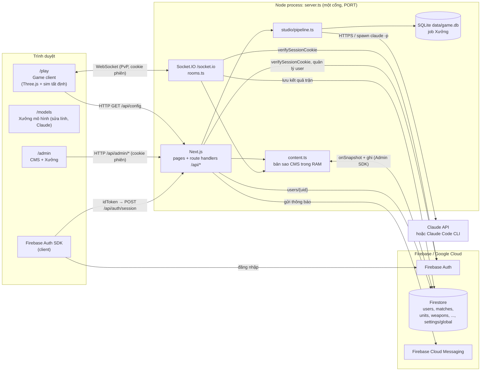
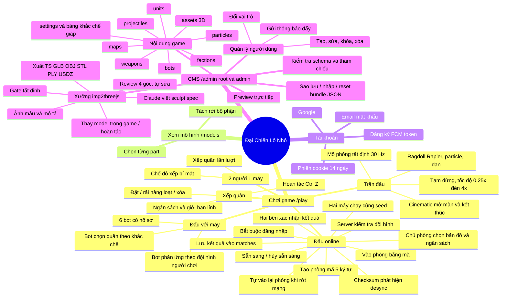
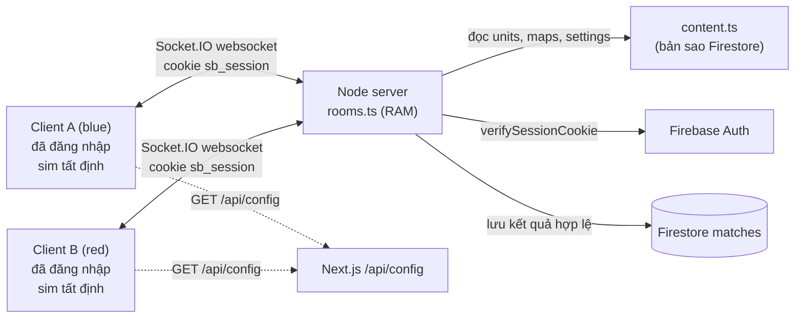
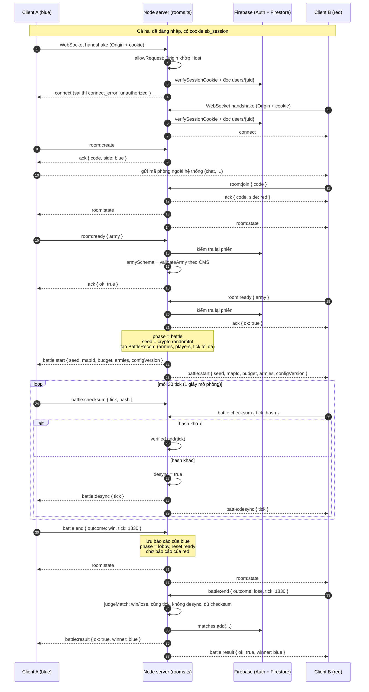
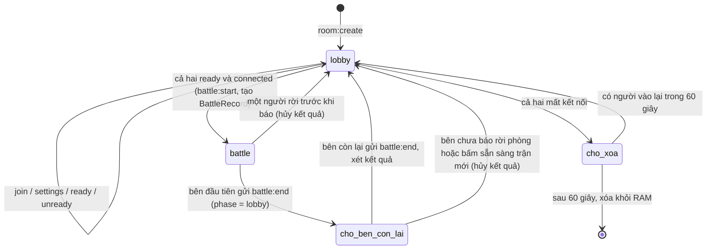
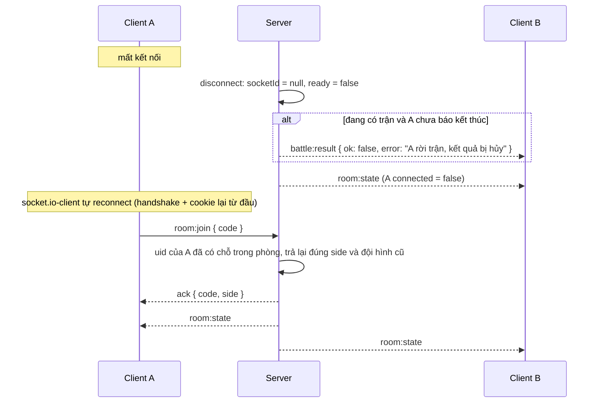
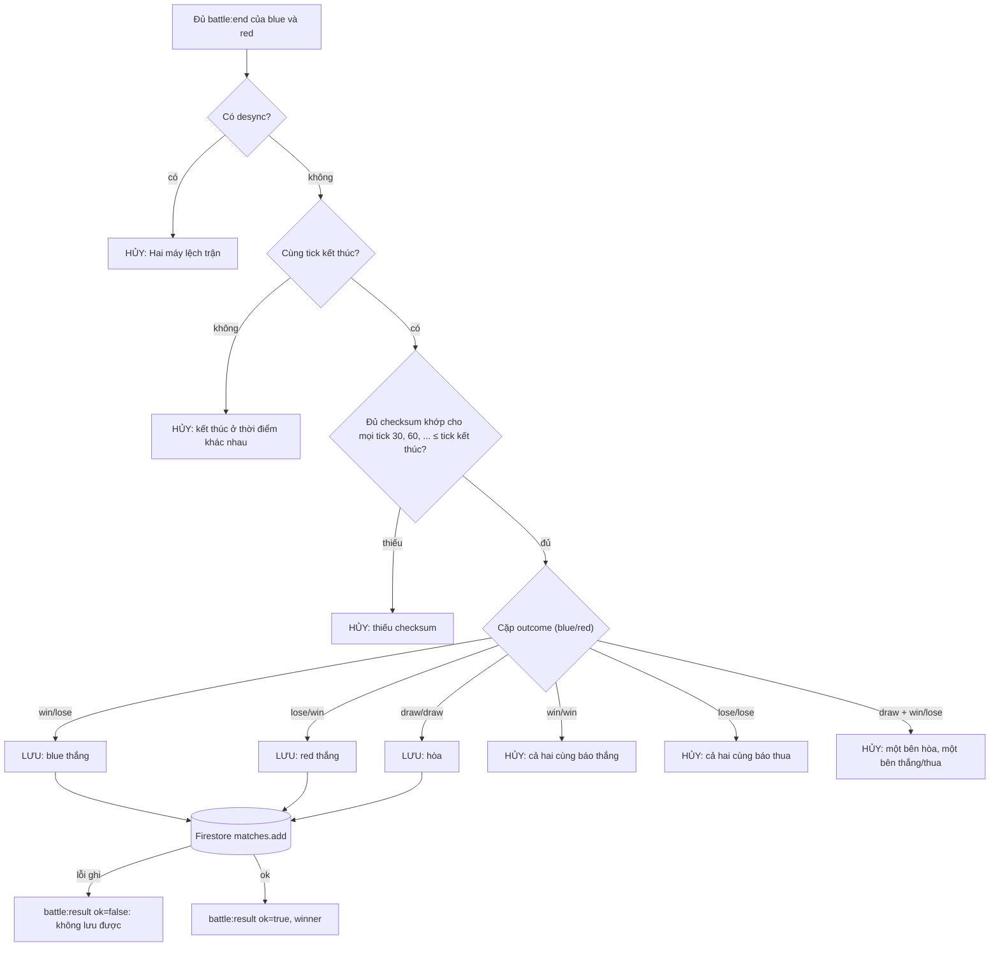
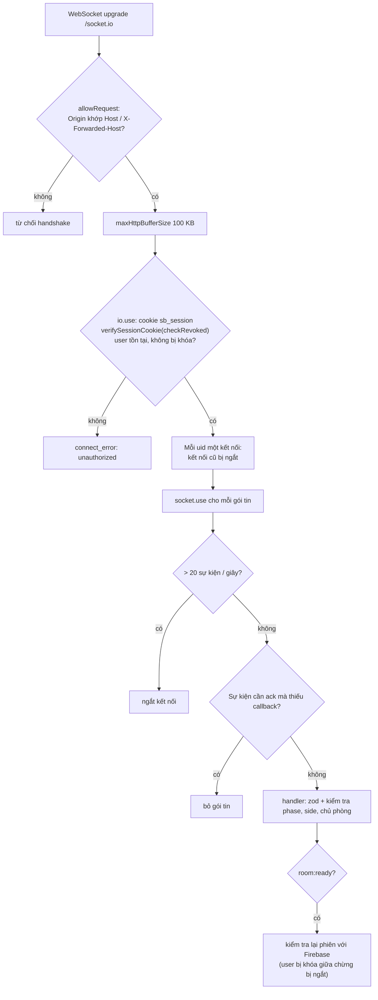
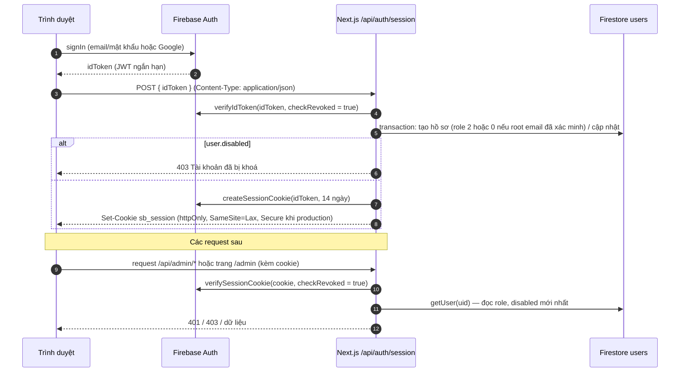
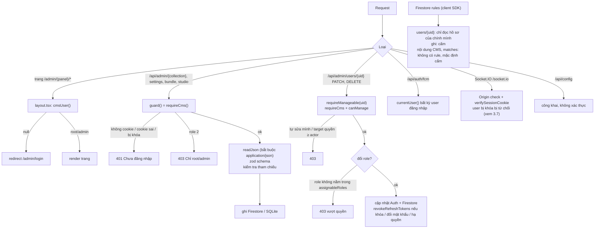

# Đại Chiến Lô Nhô — Tài liệu kiến trúc, PvP online, phân quyền và bảo mật

Tài liệu mô tả hệ thống theo code hiện tại (Next.js 16 + Socket.IO trong một tiến trình Node, Firebase Auth/Firestore/FCM, SQLite, Claude API/CLI). Sơ đồ viết bằng Mermaid, xem được trực tiếp trên GitHub/VS Code.

Mục lục:

1. [Tổng quan hệ thống](#1-tổng-quan-hệ-thống)
2. [Sơ đồ tất cả tính năng](#2-sơ-đồ-tất-cả-tính-năng)
3. [Giao tiếp cho tính năng người vs người (online)](#3-giao-tiếp-cho-tính-năng-người-vs-người-online)
4. [Cơ chế phân quyền](#4-cơ-chế-phân-quyền)
5. [Bảo mật](#5-bảo-mật)
6. [Phụ lục: bảng API](#6-phụ-lục-bảng-api)

---

## 1. Tổng quan hệ thống

Điểm chính:

- **Một tiến trình Node** chạy cả Next.js và Socket.IO trên cùng cổng. Không có microservice, không có server-to-server giữa các node game. Muốn chạy nhiều instance cần thêm adapter (Redis) cho Socket.IO và sticky session — hiện **chưa có**.
- **Giao tiếp server-to-server** thực tế chỉ có: Node ↔ Firebase (Auth, Firestore, FCM qua Admin SDK) và Node ↔ Anthropic (Claude API) hoặc tiến trình con `claude` CLI.
- **Nội dung CMS** là nguồn chuẩn cho cả game, bot và kiểm tra đội hình online. Server giữ bản sao RAM qua snapshot listener; sửa trên CMS hay Firebase Console đều áp dụng từ trận sau.

---

## 2. Sơ đồ tất cả tính năng

Bảng tính năng theo module code:

| Nhóm | Tính năng | Code chính |
| --- | --- | --- |
| Game | 3 chế độ `ai` / `local` / `online` | [GameClient.tsx](../src/components/game/GameClient.tsx) |
| Game | Mô phỏng tất định, checksum | [world.ts](../src/game/sim/world.ts), [engine.ts](../src/game/render/engine.ts) |
| Game | Kiểm tra đội hình (dùng chung client + server) | [army.ts](../src/game/sim/army.ts) |
| Game | Bot | [generate.ts](../src/game/bot/generate.ts) |
| Online | Xác thực socket, phòng, sẵn sàng, bắt đầu trận, desync | [rooms.ts](../src/server/rooms.ts), [net.ts](../src/shared/net.ts), [client.ts](../src/game/net/client.ts) |
| Online | Xác nhận và lưu kết quả trận | [matches.ts](../src/server/matches.ts) |
| Nội dung | Firestore + bản sao RAM + seed | [content.ts](../src/server/content.ts), [schema.ts](../src/shared/schema.ts) |
| Tài khoản | Phiên, hồ sơ, vai trò | [users.ts](../src/server/users.ts), [shared/users.ts](../src/shared/users.ts), [session route](../src/app/api/auth/session/route.ts) |
| CMS | CRUD collection, settings, bundle | [src/app/api/admin/](../src/app/api/admin/) |
| CMS | Quản lý user, FCM | [users routes](../src/app/api/admin/users/), [userAdmin.ts](../src/server/userAdmin.ts) |
| Xưởng | Pipeline Claude, gate, xuất file | [studio/](../src/server/studio/), [sculpt/](../src/game/sculpt/) |

---

## 3. Giao tiếp cho tính năng người vs người (online)

### 3.1 Mô hình: server làm trọng tài, không mô phỏng

Hai người chơi **không nói chuyện trực tiếp với nhau** (không P2P/WebRTC) và **không có server-to-server**. Luồng là **Client A ↔ Node server ↔ Client B** qua Socket.IO (chỉ transport `websocket`).

Server **không chạy trận**. Server làm 5 việc:

1. **Xác thực kết nối:** chỉ user đã đăng nhập, không bị khóa, mở từ đúng trang của site mới kết nối được (xem 3.7).
2. **Quản lý phòng:** tạo, vào, chỗ ngồi `blue`/`red`. Chỗ ngồi gắn với `uid`.
3. **Kiểm tra đội hình** theo dữ liệu CMS: schema, lính tồn tại, trong vùng triển khai, số lính, ngân sách.
4. **Bắt đầu trận** khi cả hai sẵn sàng: sinh `seed` bằng `crypto.randomInt`, gửi `battle:start` gồm seed, hai đội hình và `configVersion`, đồng thời giữ bản ghi trận (`BattleRecord`) trên server.
5. **Trọng tài kết quả:** so checksum mỗi 30 tick (1 giây mô phỏng). Kết quả chỉ được lưu vào Firestore `matches` khi **hai bên báo khớp nhau** (xem 3.6).

Hai trình duyệt tự chạy cùng một trận. Mô phỏng chỉ dùng `+ - * /`, `Math.sqrt` và PRNG có seed, nên kết quả trùng từng bit.

### 3.2 Giao thức sự kiện

Định nghĩa ở [src/shared/net.ts](../src/shared/net.ts). Client không gửi tên hay token: server lấy danh tính và tên hiển thị từ cookie phiên.

Client → Server:

| Sự kiện | Payload | Ack | Điều kiện server chấp nhận |
| --- | --- | --- | --- |
| `room:create` | — | `{ ok, code, side }` | CMS có ít nhất 1 map |
| `room:join` | `{ code }` | `{ ok, code, side }` | phòng tồn tại; `uid` đã có chỗ trong phòng thì lấy lại chỗ đó, không thì vào `red` nếu còn trống |
| `room:settings` | `{ mapId, budget }` | — | chỉ `blue` (chủ phòng), phase `lobby`, map tồn tại, budget 100–1.000.000 |
| `room:ready` | `{ army: Placement[] }` | `{ ok }` / `{ ok:false, error }` | phiên vẫn hợp lệ (kiểm tra lại với Firebase), phase `lobby`, `armySchema` (≤ 500), `validateArmy` pass, không rỗng |
| `room:unready` | — | — | phase `lobby` |
| `battle:checksum` | `{ tick, hash }` | — | đang có trận, bên này chưa báo kết thúc, `tick` là bội số dương của 30 và ≤ tick tối đa, mỗi tick chỉ nhận lần đầu |
| `battle:end` | `{ outcome: 'win' \| 'lose' \| 'draw', tick }` | — | đang có trận, bên này chưa báo; payload sai thì hủy kết quả |
| `room:leave` / `disconnect` | — | — | luôn |

Server → Client:

| Sự kiện | Payload | Khi nào |
| --- | --- | --- |
| `room:state` | `{ code, phase, mapId, budget, players: { name, ready, connected, units, cost } }` | mọi thay đổi phòng (gửi cả phòng) |
| `battle:start` | `{ seed, mapId, budget, armies: { blue, red }, configVersion }` | cả hai `ready` và cùng đang kết nối |
| `battle:desync` | `{ tick }` | hash hai bên khác nhau tại cùng tick (lần đầu) |
| `battle:result` | `{ ok: true, winner }` / `{ ok: false, error }` | kết quả đã lưu, hoặc bị hủy kèm lý do |

Lưu ý: `room:state` **chỉ lộ tên, số lính và tổng chi phí**, không lộ vị trí/loại lính. Đội hình đối thủ chỉ gửi xuống lúc `battle:start`.

### 3.3 Trình tự một trận

### 3.4 Vòng đời phòng và trận

`phase` quyết định có được xếp quân/sẵn sàng hay không; `battle` là bản ghi trận, tồn tại độc lập đến khi được lưu hoặc hủy. Người báo kết thúc trước có thể quay về xếp quân ngay, trong khi người kia vẫn xem nốt trận (ví dụ đang chạy 0.25×).

### 3.5 Rớt mạng và vào lại

- Chỗ ngồi gắn `uid`, không còn token trong `sessionStorage`. Người khác không chiếm được chỗ, và một người không tự vào chỗ `red` trong phòng của mình.
- Trạng thái phòng chỉ nằm trong RAM: **khởi động lại server là mất mọi phòng và trận đang chờ xác nhận**.

### 3.6 Xác nhận kết quả trận

Mỗi client báo kết quả **theo góc nhìn của mình** (`win` / `lose` / `draw`) kèm tick kết thúc. Server chỉ xét khi **đủ báo cáo của cả hai bên** ([src/server/matches.ts](../src/server/matches.ts), `judgeMatch`):

Các trường hợp hủy khác (không chờ đủ hai báo cáo):

| Tình huống | Kết quả |
| --- | --- |
| Người chưa báo kết thúc rời phòng / mất kết nối | hủy, báo bên còn lại |
| Người chưa báo kết thúc bấm sẵn sàng cho trận mới | hủy (bỏ dở trận) |
| `battle:end` sai định dạng (outcome lạ, tick ngoài 1..tick tối đa) | hủy |
| Báo cáo thứ hai của cùng một bên | bỏ qua (chỉ nhận lần đầu) |

Tài liệu `matches/{autoId}` lưu:

| Trường | Ý nghĩa |
| --- | --- |
| `room`, `seed`, `mapId`, `budget`, `configVersion` | tham số trận do **server** giữ, không lấy từ client lúc kết thúc |
| `players.blue/red` | `{ uid, name }` |
| `armies.blue/red` | đội hình đã được server kiểm tra, đủ để chạy lại trận |
| `winner` | `blue` / `red` / `draw` |
| `endTick` | tick kết thúc hai bên cùng báo |
| `startedAt`, `endedAt` | thời điểm bắt đầu (server) và lưu (`serverTimestamp`) |

Firestore rules không mở `matches` cho client (mặc định cấm): chỉ server ghi bằng Admin SDK.

### 3.7 Lớp bảo vệ Socket.IO

| Lớp | Chặn cái gì |
| --- | --- |
| Origin check | trang web lạ mở WebSocket tới server bằng trình duyệt của nạn nhân (Cross-Site WebSocket Hijacking) |
| Cookie phiên + `checkRevoked` + `disabled` | khách vô danh, cookie giả, tài khoản bị khóa hoặc đã bị thu hồi phiên |
| Kiểm tra lại phiên ở `room:ready` | tài khoản bị khóa trong lúc đang kết nối tiếp tục mở trận mới |
| Một kết nối mỗi `uid` | một tài khoản mở nhiều socket để tạo hàng loạt phòng, hoặc tự đấu với chính mình |
| Rate limit 20 sự kiện/giây, gói ≤ 100 KB | spam sự kiện, gói tin khổng lồ |
| Bỏ gói thiếu ack | **một gói `room:join` không có callback làm sập cả tiến trình Node** (lỗi đã xác nhận trước khi sửa: `TypeError: ack is not a function`) |
| zod + phase/side/chủ phòng | payload sai kiểu, gửi sự kiện sai thời điểm, người không phải chủ phòng đổi map |
| `validateArmy` trên server | đội hình vượt ngân sách, ngoài vùng, lính không tồn tại |
| Seed do server sinh, đội hình do server gửi | client tự chọn seed hoặc đổi đội hình sau khi đối thủ sẵn sàng |
| Checksum đối chiếu, tick hợp lệ, chỉ nhận lần đầu | client sửa đổi làm lệch trận, gửi checksum rác để làm phình bộ nhớ |
| Đồng thuận hai bên khi lưu kết quả | một client gian lận tự khai thắng |

**Giới hạn còn lại:** hai người **thông đồng** vẫn khai được kết quả tùy ý (cả hai cùng sửa client). Người sắp thua có thể **thoát trước khi trận kết thúc** để hủy kết quả thay vì nhận thua. Muốn chặn cả hai thì server phải tự chạy lại trận từ `seed` + `armies` (mô phỏng tất định nên làm được, nên chạy trong `worker_threads`); `matches` đã lưu đủ dữ liệu để làm việc này sau.

---

## 4. Cơ chế phân quyền

### 4.1 Vai trò

Lưu ở Firestore `users/{uid}.role` ([src/shared/users.ts](../src/shared/users.ts)):

| Giá trị | Vai trò | Quyền |
| --- | --- | --- |
| `0` | Root | toàn quyền CMS, quản lý mọi user khác (kể cả root/admin khác), cấp mọi vai trò |
| `1` | Admin | toàn quyền nội dung CMS + Xưởng; chỉ quản lý user role `2`; chỉ cấp role `2` |
| `2` | Người dùng | chơi mọi chế độ kể cả online (kết quả lưu theo `uid`), đăng ký FCM token; không vào `/admin` |
| — | Khách (chưa đăng nhập) | chơi với máy, 2 người 1 máy, xem `/models`, đọc `/api/config`; **không** đấu online |

Quy tắc (hàm thuần, dùng chung):

- `canAccessCms(user)`: đăng nhập, không bị khóa, `role <= 1`.
- `canManage(actor, target)`: không tự sửa chính mình; root quản lý tất cả; người khác chỉ quản lý người có `role` lớn hơn (thấp quyền hơn).
- `assignableRoles(actor)`: root cấp `0,1,2`; admin chỉ cấp `2`.
- Root đầu tiên: email trong `FIREBASE_ROOT_EMAILS` **và đã xác minh** (`emailVerified`) → mỗi lần đăng nhập được đặt `role = 0`.

### 4.2 Luồng xác thực

### 4.3 Kiểm tra quyền trên từng lớp

Ma trận quyền theo endpoint:

| Endpoint | Khách | User (2) | Admin (1) | Root (0) |
| --- | --- | --- | --- | --- |
| `GET /api/config` | ✓ | ✓ | ✓ | ✓ |
| Socket.IO `/socket.io` (PvP) | ✗ | ✓ | ✓ | ✓ |
| `GET/POST/DELETE /api/auth/session` | ✓ | ✓ | ✓ | ✓ |
| `POST /api/auth/fcm` | ✗ | ✓ | ✓ | ✓ |
| Trang `/admin/*` | ✗ | ✗ | ✓ | ✓ |
| `/api/admin/{collection}[/{id}]`, `settings`, `bundle` | ✗ | ✗ | ✓ | ✓ |
| `/api/admin/studio/**` (gọi Claude, tốn chi phí) | ✗ | ✗ | ✓ | ✓ |
| `GET /api/admin/users[/{uid}]` | ✗ | ✗ | ✓ (xem tất cả) | ✓ |
| `POST /api/admin/users` | ✗ | ✗ | chỉ tạo role 2 | mọi role |
| `PATCH/DELETE /api/admin/users/{uid}` | ✗ | ✗ | chỉ target role 2, không phải mình | mọi target trừ mình |
| `POST /api/admin/users/{uid}/notify` | ✗ | ✗ | ✓ (mọi user) | ✓ |

---

## 5. Bảo mật

### 5.1 Các biện pháp đang có

**Xác thực, phiên**

- Phiên dùng Firebase **session cookie** `sb_session`: `httpOnly` (JS không đọc được), `SameSite=Lax`, `Secure` ở production, tối đa 14 ngày.
- `verifyIdToken` và `verifySessionCookie` đều bật `checkRevoked`. Khóa user, đổi mật khẩu hoặc hạ quyền sẽ gọi `revokeRefreshTokens`, nên cookie cũ mất hiệu lực ngay.
- Mỗi request HTTP (và mỗi handshake Socket.IO) đọc lại hồ sơ Firestore, nên đổi `role`/`disabled` áp dụng tức thì, không phụ thuộc token cũ.
- Root bootstrap chỉ nhận **email đã xác minh**, tránh việc tạo tài khoản email/mật khẩu chưa xác minh trùng email root.

**Chống CSRF**

- Cookie `SameSite=Lax`: request cross-site bằng `fetch`/form POST không kèm cookie.
- `readJson` bắt buộc `Content-Type: application/json` cho mọi thao tác ghi, chặn form HTML cross-site (form không gửi được JSON content type mà không qua preflight CORS).
- WebSocket: kiểm tra `Origin` khi handshake (xem 3.7).

**Kiểm tra dữ liệu vào**

- Mọi payload API và Socket.IO đi qua **zod** (`COLLECTION_SCHEMAS`, `settingsSchema`, `armySchema`, `createUserSchema`, ...). Không đổi được `id` qua PUT.
- Kiểm tra tham chiếu chéo (`findRefIssues`) khi tạo/sửa/nhập, chặn xóa khi còn phụ thuộc (`findDependents`).
- Tài liệu Firestore sửa tay sai schema bị bỏ qua và ghi log, không làm hỏng game.
- Giới hạn kích thước: ảnh Xưởng ≤ 12 MB dạng data URL PNG/JPEG/WebP/GIF, sheet review ≤ 8 MB, prompt ≤ 4000 ký tự, idToken ≤ 4096, gói Socket.IO ≤ 100 KB.

**Firestore**

- Client SDK chỉ đọc được `users/{uid}` của chính mình; mọi ghi đi qua server (Admin SDK). Collection nội dung và `matches` không có rule nên client bị chặn mặc định; game đọc nội dung qua `/api/config`.
- Service account chỉ nằm ở biến môi trường server (`FIREBASE_SERVICE_ACCOUNT`), không có tiền tố `NEXT_PUBLIC_`.

**PvP online** — chi tiết ở [3.6](#36-xác-nhận-kết-quả-trận) và [3.7](#37-lớp-bảo-vệ-socketio)

- Bắt buộc đăng nhập, kiểm tra Origin, một kết nối mỗi tài khoản, rate limit, giới hạn kích thước gói, bỏ gói thiếu ack.
- Server là nguồn chuẩn cho **luật xếp quân** (`validateArmy` với dữ liệu CMS trên server), **seed** (`crypto.randomInt`) và **tham số trận** lưu vào `matches`.
- Kết quả chỉ lưu khi hai bên báo khớp (win/lose hoặc draw/draw), cùng tick, không desync, đủ checksum; còn lại hủy.
- Đội hình đối thủ không lộ trong lobby; chỉ chủ phòng đổi map/ngân sách và mọi thay đổi reset sẵn sàng.
- `configVersion` (hash SHA-1 của nội dung) giúp phát hiện hai máy dùng dữ liệu CMS khác nhau.

**Xưởng img2threejs (AI)**

- Claude **chỉ trả JSON sculpt spec**, không trả code. Spec được parse bằng schema và dựng bởi generator tin cậy trong [src/game/sculpt](../src/game/sculpt/); không có `eval`/`new Function` nào chạy nội dung AI.
- CLI chạy với `--safe-mode --tools ""` (không tool, không đọc CLAUDE.md/hook/MCP), `cwd` là thư mục tạm, không lưu session.
- `ANTHROPIC_API_KEY` chỉ ở server. Chỉ root/admin gọi được Xưởng.

**Khác**

- Nội dung do người dùng nhập (tên hiển thị) render qua React nên được escape tự động.

### 5.2 Đã xử lý

| Vấn đề trước đây | Cách xử lý | Kiểm chứng |
| --- | --- | --- |
| **Sập server bằng một gói tin:** `room:join`/`room:create`/`room:ready` không kèm ack làm handler ném `TypeError: ack is not a function`, tiến trình Node thoát | `socket.use` bỏ các gói thiếu callback | đã tái hiện lỗi trước khi sửa; test `a packet without its ack callback is dropped...` |
| Socket.IO không xác thực | handshake bắt buộc cookie phiên hợp lệ, user không bị khóa; kiểm tra lại ở `room:ready` | test handshake + chạy thử server thật: không cookie / cookie giả → `unauthorized` |
| Không giới hạn origin cho WebSocket | `allowRequest` so `Origin` với `Host` / `X-Forwarded-Host` | test + server thật: origin lạ bị từ chối |
| Không rate limit sự kiện socket, gói tối đa 1 MB | 20 sự kiện/giây mỗi socket (vượt thì ngắt), `maxHttpBufferSize` 100 KB, mỗi `uid` một kết nối | test `flooding events...`, `a second connection...` |
| Kết quả trận do một client quyết định | đồng thuận hai bên + cùng tick + không desync + đủ checksum; lưu Firestore `matches` | `matches.test.ts` (luật) và `rooms.test.ts` (luồng thật: lưu, cùng báo thắng, desync, rời trận) |
| Token vào lại phòng lưu `sessionStorage` | bỏ token, chỗ ngồi gắn `uid` | test `joining your own room gives your seat back...` |
| Checksum giới hạn bằng cách xóa mục cũ (có thể mất dữ liệu đối chiếu) | chỉ nhận tick là bội số của 30 trong giới hạn thời gian trận, mỗi tick một lần | `rooms.test.ts` |

### 5.3 Rủi ro còn lại

Xếp theo mức độ ưu tiên khuyến nghị. Đây là nhận định từ đọc code và test, chưa pentest.

| # | Mức | Vấn đề | Chi tiết | Hướng xử lý gợi ý |
| --- | --- | --- | --- | --- |
| 1 | Trung bình | **Thông đồng và thoát trận để né thua** | Hai client cùng sửa đổi khai được kết quả bất kỳ. Người sắp thua ngắt kết nối trước khi trận kết thúc thì kết quả bị hủy thay vì ghi thua. | Server chạy lại trận từ `seed` + `armies` trong `worker_threads` để ra kết quả chuẩn; hoặc xử thua người rời trận khi checksum đến lúc rời vẫn khớp. |
| 2 | Trung bình | **Chưa giới hạn theo IP / tổng số phòng** | Mỗi tài khoản chỉ một kết nối, nhưng nhiều tài khoản (tạo tự do bằng email) vẫn tạo được nhiều phòng. Handshake gọi Firebase cho mỗi lần kết nối. | Giới hạn kết nối theo IP ở reverse proxy, giới hạn tổng số phòng, bắt buộc xác minh email. |
| 3 | Thấp–TB | **Không có security header** | Chưa đặt CSP, `X-Frame-Options`/`frame-ancestors`, `Referrer-Policy`, HSTS trong [next.config.ts](../next.config.ts). `/admin` có thể bị nhúng iframe (clickjacking). | Thêm `headers()` trong Next config hoặc ở reverse proxy. |
| 4 | Thấp–TB | **Không rate limit API HTTP** | `/api/auth/session` và các route admin không giới hạn tốc độ. Xưởng có thể bị gọi dồn gây tốn chi phí Claude nếu tài khoản admin bị lộ. | Rate limit theo IP/uid ở reverse proxy hoặc middleware; giới hạn số job chạy song song. |
| 5 | Thấp | **Guard nằm rải rác trong từng route** | Không có `middleware`/`proxy` chung cho `/api/admin/*`; route mới quên gọi `guard()` sẽ mở công khai. | Thêm middleware kiểm tra cookie cho `/api/admin` (lớp 1) và giữ `guard()` (lớp 2); thêm test liệt kê route. |
| 6 | Thấp | **Root theo biến môi trường luôn được nâng lại** | Email trong `FIREBASE_ROOT_EMAILS` được đặt `role = 0` **mỗi lần đăng nhập**; hạ quyền trong CMS sẽ bị hoàn tác. Nếu tài khoản Google đó bị chiếm, không hạ quyền được bằng CMS (chỉ khóa `disabled` được, và chỉ root khác làm được). | Gỡ email khỏi biến môi trường sau khi bootstrap. |
| 7 | Thấp | **Admin gửi thông báo tới mọi user** | `notify` chỉ dùng `requireCms`, không dùng `canManage`: admin gửi được push tới root/admin khác. `GET /api/admin/users` trả cả `fcmTokens` cho admin. | Dùng `requireManageable` cho notify; ẩn `fcmTokens` trong response danh sách. |
| 8 | Thấp | **Lộ `e.message` của lỗi không xác định** | `firebaseErrorResponse` và stream Xưởng trả thông điệp lỗi gốc cho client (chỉ root/admin thấy). | Log chi tiết ở server, trả thông báo chung ở production. |
| 9 | Vận hành | **Trạng thái phòng chỉ trong RAM, một instance** | Restart/deploy làm mất mọi phòng và trận đang chờ xác nhận; không scale ngang được. Map "một kết nối mỗi uid" cũng chỉ đúng trong một instance. | Redis adapter + sticky session + khóa phân tán nếu cần nhiều instance. |
| 10 | Vận hành | **Engine CLI dùng login `claude` của máy chủ** | Tài khoản Claude của người vận hành gắn với server; ai chiếm được quyền admin CMS là dùng được quota đó. | Ưu tiên `ANTHROPIC_API_KEY` riêng có giới hạn chi tiêu ở production. |

### 5.4 Checklist triển khai production

- [ ] `NODE_ENV=production` (bật cookie `Secure`), chạy sau HTTPS.
- [ ] `FIREBASE_SERVICE_ACCOUNT` đặt qua secret manager, không commit `.env`.
- [ ] Triển khai [firestore.rules](../firestore.rules) lên Firebase (không mở `matches` cho client).
- [ ] Bật provider Email/Password + Google; cân nhắc bắt buộc xác minh email.
- [ ] Sau khi có root: xóa email khỏi `FIREBASE_ROOT_EMAILS` (rủi ro 6).
- [ ] Reverse proxy: **giữ nguyên `Host` hoặc gửi `X-Forwarded-Host`** (không thì Origin check chặn mọi kết nối online), hỗ trợ WebSocket upgrade, rate limit, security header, giới hạn kích thước body.
- [ ] `ANTHROPIC_API_KEY` riêng, đặt giới hạn chi tiêu.
- [ ] Sao lưu Firestore định kỳ (hoặc tải bundle JSON từ CMS) và file SQLite `data/game.db`.
- [ ] Chạy một instance (hoặc thêm Redis adapter trước khi scale).

---

## 6. Phụ lục: bảng API

| Method | Đường dẫn | Quyền | Mô tả |
| --- | --- | --- | --- |
| GET | `/api/config` | công khai | bundle nội dung + `version` cho game |
| GET | `/api/auth/session` | công khai | hồ sơ hiện tại hoặc `null` |
| POST | `/api/auth/session` | công khai (cần idToken hợp lệ) | đổi idToken lấy cookie phiên, tạo/cập nhật hồ sơ |
| DELETE | `/api/auth/session` | công khai | xóa cookie phiên |
| POST | `/api/auth/fcm` | user đăng nhập | lưu FCM token của thiết bị |
| GET / POST | `/api/admin/{collection}` | root/admin | liệt kê / tạo tài liệu |
| GET / PUT / DELETE | `/api/admin/{collection}/{id}` | root/admin | đọc / sửa / xóa (chặn khi còn phụ thuộc) |
| GET / PUT | `/api/admin/settings` | root/admin | cài đặt game |
| GET / PUT / POST | `/api/admin/bundle` | root/admin | tải bundle JSON / nhập thay toàn bộ / `{action:"reset"}` / `{action:"merge", docs, skills}` thêm nội dung mặc định còn thiếu (không sửa mục đang có) |
| GET / POST | `/api/admin/studio` | root/admin | trạng thái engine + danh sách job / tạo job |
| GET / DELETE | `/api/admin/studio/{id}` | root/admin | chi tiết job / xóa job (không khi đang chạy) |
| POST | `/api/admin/studio/{id}/run` | root/admin | chạy bước `spec` / `review` (stream NDJSON) hoặc `stop` |
| POST | `/api/admin/studio/codegen` | root/admin | sinh file TypeScript từ sculpt spec (version hoặc asset đã áp dụng) |
| GET / POST | `/api/admin/users` | root/admin | danh sách / tạo user (giới hạn role cấp được) |
| GET / PATCH / DELETE | `/api/admin/users/{uid}` | root/admin + `canManage` cho PATCH/DELETE | xem / sửa / xóa user |
| POST | `/api/admin/users/{uid}/notify` | root/admin | gửi push FCM tới mọi thiết bị của user |
| WS | `/socket.io` | user đăng nhập, cùng origin | PvP online, xem mục 3 |
