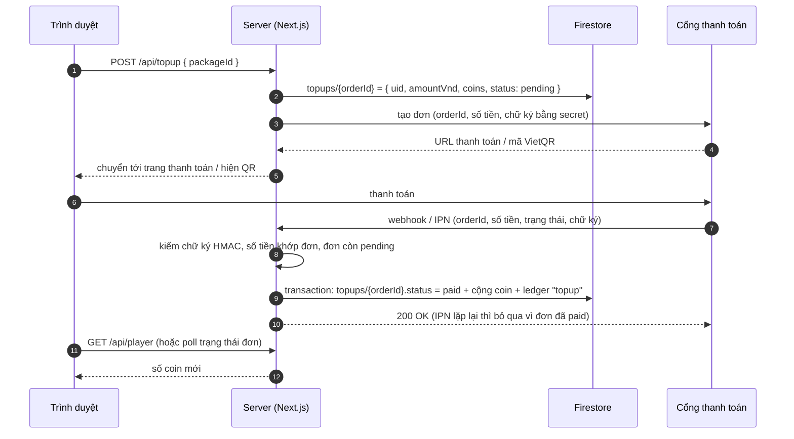

# Kế hoạch kiếm tiền và nạp tiền — Đại Chiến Lô Nhô

Tài liệu kế hoạch (Phase 2). Phần **đã làm** nằm ở mục 3; phần nạp tiền thật (cổng thanh toán, pháp lý) là **kế hoạch, chưa có code**. Thông tin pháp lý tổng hợp từ nguồn công khai tại thời điểm viết (09/2026), không thay cho tư vấn luật sư.

Mục lục:

1. [Totally Accurate Battle Simulator kiếm tiền như thế nào](#1-totally-accurate-battle-simulator-kiếm-tiền-như-thế-nào)
2. [Mô hình đề xuất cho game này](#2-mô-hình-đề-xuất-cho-game-này)
3. [Đã làm trong Phase 2: ví coin](#3-đã-làm-trong-phase-2-ví-coin)
4. [Kế hoạch nối cổng thanh toán](#4-kế-hoạch-nối-cổng-thanh-toán)
5. [Pháp lý tại Việt Nam](#5-pháp-lý-tại-việt-nam)
6. [Lộ trình](#6-lộ-trình)

---

## 1. Totally Accurate Battle Simulator kiếm tiền như thế nào

TABS (Landfall Games) là **game trả tiền một lần** (premium), không phải game miễn phí có nạp tiền:

| Nguồn thu | Chi tiết |
| --- | --- |
| Bán bản quyền game | Mua một lần trên Steam, Epic Games, Microsoft Store (PC/Mac), sau đó phát hành thêm trên Xbox, Nintendo Switch, PlayStation, iOS và Android. Giá gốc khoảng 20 USD, giảm giá sâu trong các đợt sale. |
| Xbox Game Pass | Có mặt trong Game Pass (console, PC, cloud): nguồn thu từ hợp đồng với Microsoft thay vì từ từng người chơi. |
| DLC trả phí | Một gói DLC vui ("Bug DLC", thêm công cụ và hiệu ứng "bug" hài hước), không bán sức mạnh. |
| Cập nhật miễn phí | Phe, lính, bản đồ, Unit Creator và Steam Workshop đều miễn phí để giữ người chơi và kéo doanh số bản gốc. |

Điểm quan trọng: TABS **không có vật phẩm trả tiền, không có tiền tệ ảo, không pay-to-win**. Doanh thu đến từ việc game vui, dễ lan truyền (video YouTube/TikTok) và có mặt trên nhiều nền tảng.

**Vì sao không copy nguyên mô hình này:** game của mình chạy trên web, ai mở link cũng chơi được, không có cửa hàng (Steam/console) thu tiền hộ. Bán "bản quyền" một lần trên web khó và dễ bị lách. Vì vậy đề xuất mô hình lai ở mục 2.

## 2. Mô hình đề xuất cho game này

Miễn phí để chơi, thu tiền qua **coin** (1.000 VNĐ = 1.000 coin), giữ tinh thần vui và công bằng của TABS:

| Nhóm | Người chơi trả tiền được gì | Ghi chú |
| --- | --- | --- |
| Mở khóa lính | Lính cao cấp (rồng, thần sấm, voi ma mút…) mở bằng coin | Lính rẻ (≤ 150) miễn phí cho mọi người, kể cả khách |
| Thẻ bài và sao | Mua thẻ để nâng sao nhanh hơn thay vì chờ hộp quà | Hộp quà hằng ngày và hộp x giờ vẫn cho thẻ miễn phí |
| Công bằng khi đấu online | Chủ phòng bật/tắt "Tính sao nâng cấp" | Đấu với bạn bè có thể tắt sao để chỉ so tài xếp quân |
| Mở rộng sau này | Skin lính, hiệu ứng thắng trận, bản đồ, battle pass theo mùa | Chỉ hình thức, không tăng sức mạnh: rủi ro pháp lý và phản ứng người chơi thấp hơn |
| Quảng cáo (tùy chọn) | Xem video nhận thêm hộp quà | Chỉ khi đủ lượng người chơi |

Nguyên tắc thiết kế:

- **Hộp quà hiện tại miễn phí** (không bán hộp ngẫu nhiên). Nếu sau này bán hộp có phần thưởng ngẫu nhiên, phải công bố tỉ lệ rơi và cân nhắc giới hạn chi tiêu.
- Coin **không đổi ngược ra tiền**, không chuyển/bán giữa người chơi (đúng yêu cầu pháp lý, xem mục 5).
- Gói nạp gợi ý: 20.000đ, 50.000đ, 100.000đ, 200.000đ, 500.000đ (có thể tặng thêm % coin ở gói lớn — nhớ khai báo trong hồ sơ phát hành).

## 3. Đã làm trong Phase 2: ví coin

- Ví của từng người chơi trên Firestore `players/{uid}`: `coins`, `cards` (thẻ theo lính), `stars` (0–5), `unlocked` (lính đã mua), `dailyDay`, `lastBoxAt`. Mỗi thay đổi ghi thêm một dòng vào `players/{uid}/ledger` (loại, số coin +/-, số dư sau, thẻ, lính, sao, ghi chú, admin thực hiện).
- **Chỉ server ghi** (Admin SDK trong transaction), Firestore rules chặn mọi đọc/ghi từ client. Giá, phần thưởng và thời gian đều do server quyết định.
- Coin có từ hộp quà và từ **admin cộng tay trong CMS** (`/admin/users/{uid}` → Ví coin & bộ sưu tập, bắt buộc ghi lý do). Đây là cách "nạp tiền" tạm thời: người chơi chuyển khoản, admin đối soát rồi cộng coin kèm mã giao dịch trong ghi chú.
- Chi tiết kỹ thuật: [ARCHITECTURE.md mục 6](ARCHITECTURE.md#6-tiền-tệ-thẻ-bài-hộp-quà).

## 4. Kế hoạch nối cổng thanh toán

Chưa có code. Khi có tài khoản merchant, luồng dùng chung cho mọi cổng:

| Cổng | Cách người dùng trả | Xác thực callback | Phù hợp khi |
| --- | --- | --- | --- |
| payOS / SePay (VietQR) | Quét QR chuyển khoản ngân hàng | Chữ ký checksum / API key của webhook | Muốn phí thấp, người chơi Việt quen chuyển khoản |
| VNPay | Thẻ ATM, QR ngân hàng, thẻ quốc tế | IPN ký HMAC-SHA512 | Cần nhiều phương thức, có pháp nhân |
| MoMo | Ví MoMo | IPN ký HMAC-SHA256 | Tệp người chơi trẻ dùng ví điện tử |

Quy tắc bắt buộc khi làm:

- **Chỉ tin webhook/IPN đã kiểm chữ ký**, không tin trang "thanh toán thành công" trả về trình duyệt.
- Idempotent: `orderId` duy nhất, chỉ chuyển `pending → paid` một lần trong transaction; IPN gửi lại không cộng coin lần hai.
- Số tiền trong callback phải khớp đơn đã lưu; gói nạp và số coin do server định nghĩa, client chỉ gửi `packageId`.
- Secret của cổng chỉ nằm trong biến môi trường server, không có tiền tố `NEXT_PUBLIC_`.
- Đối soát hằng ngày (tổng `topups` paid so với sao kê cổng), xử lý hoàn tiền bằng dòng ledger âm có ghi chú.
- Rate limit `/api/topup` và `/api/player` (hiện chưa có, xem rủi ro trong ARCHITECTURE.md).

## 5. Pháp lý tại Việt Nam

Tóm tắt những điểm ảnh hưởng trực tiếp tới việc thu tiền (cần luật sư xác nhận trước khi mở nạp tiền thật):

| Quy định | Ảnh hưởng tới game này |
| --- | --- |
| **Nghị định 147/2024/NĐ-CP** (hiệu lực 25/12/2024): phân loại G1–G4 | Đấu online qua máy chủ giữa nhiều người chơi là **G1**: cần Giấy phép cung cấp dịch vụ trò chơi điện tử G1 và Quyết định phát hành cho từng game trước khi phát hành có thu phí. |
| Vật phẩm ảo, đơn vị ảo | Chỉ tạo đúng loại đã khai trong hồ sơ phát hành; chỉ dùng trong game; **không quy đổi ngược ra tiền**, thẻ cào, thẻ ngân hàng…; không mua bán giữa người chơi. Coin, thẻ bài, sao, hộp quà phải khai báo. |
| Người chơi dưới 18 tuổi | Giới hạn thời gian chơi (không quá 60 phút mỗi game, 180 phút mỗi ngày); dưới 16 tuổi do cha mẹ đăng ký tài khoản. Game hiện chưa thu ngày sinh nên chưa đáp ứng. |
| **Nghị định 174/2026/NĐ-CP** (xử phạt, hiệu lực 01/7/2026) | Không xác thực tài khoản game bằng **số điện thoại di động Việt Nam** có thể bị phạt 40–60 triệu đồng với G1. Hiện game chỉ đăng nhập email/Google: cần thêm xác thực số điện thoại trước khi vận hành thương mại. |
| Thanh toán | Thu tiền qua tổ chức trung gian thanh toán được cấp phép (các cổng ở mục 4); xuất hóa đơn, kê khai thuế doanh thu. |

## 6. Lộ trình

| Giai đoạn | Việc |
| --- | --- |
| Phase 2 (xong) | Ví coin + sổ giao dịch trên Firestore, hộp quà hằng ngày / x giờ, thẻ bài, nâng sao, mở khóa lính, admin cộng/trừ coin, sao trong đấu online do chủ phòng chọn |
| Phase 3 | Chọn cổng (khuyến nghị bắt đầu với VietQR vì phí thấp), collection `topups`, `/api/topup` + webhook có chữ ký, màn nạp coin, báo cáo doanh thu và đối soát trong CMS, rate limit |
| Phase 4 | Pháp nhân + giấy phép G1, xác thực số điện thoại, ngày sinh và giới hạn giờ chơi cho người dưới 18 tuổi, chính sách hoàn tiền, điều khoản sử dụng |
| Sau đó | Skin/hiệu ứng thắng trận, battle pass theo mùa, ghép trận theo tổng sao nếu mở đấu xếp hạng |

Nguồn tham khảo:

- [Landfall — TABS FAQ](https://landfall.se/tabs-faq)
- [Wikipedia — Totally Accurate Battle Simulator](https://en.wikipedia.org/wiki/Totally_Accurate_Battle_Simulator)
- [Xbox Wire — TABS có trên Xbox Game Pass](https://news.xbox.com/en-us/2019/12/20/totally-accurate-battle-simulator-available-today-with-xbox-game-pass/)
- [Bộ KH&CN — Nghị định 147/2024/NĐ-CP](https://mst.gov.vn/nghi-dinh-147-2024-nd-cp-quan-ly-chat-che-dich-vu-tro-choi-dien-tu-tren-mang-va-thong-tin-tren-internet-197241227124622733.htm)
- [Thư viện pháp luật — vật phẩm ảo, điểm thưởng từ 25/12/2024](https://thuvienphapluat.vn/chinh-sach-phap-luat-moi/vn/ho-tro-phap-luat/chinh-sach-moi/75056/quy-dinh-ve-vat-pham-ao-tien-thuong-trong-tro-choi-dien-tu-tren-mang-tu-25-12-2024)
- [Thư viện pháp luật — phân loại G1, G2, G3, G4](https://thuvienphapluat.vn/phap-luat/ho-tro-phap-luat/tu-25122024-tro-choi-dien-tu-g1-g2-g3-g4-duoc-quy-dinh-ra-sao-tro-choi-dien-tu-tren-mang-phan-loai--186165.html)
- [VTV — giới hạn thời gian chơi game với người dưới 18 tuổi](https://vtv.vn/cong-nghe/gioi-han-thoi-gian-choi-game-voi-nguoi-duoi-18-tuoi-20241118081729679.htm)
- [Thanh Niên — từ 1/7/2026 không xác thực tài khoản game có thể bị phạt 60 triệu đồng](https://thanhnien.vn/tu-17-khong-xac-thuc-tai-khoan-game-co-the-bi-phat-60-trieu-dong-185260526224244509.htm)
